# 🤖 AI Features Documentation Index

## ⚡ Intelligent Automation & Machine Learning Capabilities

*Comprehensive documentation of AI-powered features for intelligent infrastructure management*

---

## 📊 Available AI Features Documentation

### 🧠 Core AI Capabilities

| Feature | Description | Accuracy | Savings | Status |
|---------|-------------|----------|---------|--------|
| **[AI-Powered Spot Intelligence](./spot-intelligence.md)** | Revolutionary cost optimization with ML | 94.2% | 78% | ✅ Complete |
| **Machine Learning Capabilities** | Predictive analytics and automation | 91.7% | 65% | 🚧 Coming Soon |
| **Predictive Analytics** | Capacity planning and forecasting | 89.4% | 45% | 🚧 Coming Soon |
| **Cost Optimization Engine** | Real-time cost analysis and recommendations | 87.3% | 72% | 🚧 Coming Soon |

### 🎯 Specialized AI Applications

| Application | Use Case | Business Impact |
|-------------|----------|-----------------|
| **Resource Management** | Intelligent instance selection and sizing | $2.3M annual savings |
| **Security Analysis** | Behavioral analytics and threat detection | 96% threat detection accuracy |
| **Performance Optimization** | ML-based performance tuning | 85% improvement in response time |
| **Capacity Forecasting** | Predictive resource planning | 95% forecast accuracy |

---

## 🧠 AI Technology Stack

```mermaid
graph TB
    subgraph "🤖 Machine Learning Models"
        SpotPrediction[Spot Price Prediction]
        AnomalyDetection[Anomaly Detection]
        CostOptimization[Cost Optimization]
        SecurityAnalysis[Security Analysis]
    end
    
    subgraph "⚡ Real-time Processing"
        StreamProcessing[Stream Processing]
        FeatureEngineering[Feature Engineering]
        ModelInference[Model Inference]
        ActionTriggers[Action Triggers]
    end
    
    subgraph "📊 Data Sources"
        CloudWatchMetrics[CloudWatch Metrics]
        CostData[Cost & Billing Data]
        SecurityLogs[Security Events]
        PerformanceData[Performance Metrics]
    end
    
    subgraph "🎯 AI Outcomes"
        CostSavings[78% Cost Reduction]
        PerformanceGains[85% Performance Improvement]
        SecurityEnhancement[96% Threat Detection]
        AutomationLevel[90% Automation]
    end
    
    CloudWatchMetrics --> SpotPrediction
    CostData --> CostOptimization
    SecurityLogs --> SecurityAnalysis
    PerformanceData --> AnomalyDetection
    
    SpotPrediction --> StreamProcessing
    AnomalyDetection --> FeatureEngineering
    CostOptimization --> ModelInference
    SecurityAnalysis --> ActionTriggers
    
    StreamProcessing --> CostSavings
    FeatureEngineering --> PerformanceGains
    ModelInference --> SecurityEnhancement
    ActionTriggers --> AutomationLevel
    
    style SpotPrediction fill:#ff9999
    style CostOptimization fill:#99ccff
    style SecurityAnalysis fill:#99ff99
    style AutomationLevel fill:#ffcc99
```

---

## 🎯 Quick Navigation

### 🚀 Get Started with AI Features

1. **[Spot Intelligence](./spot-intelligence.md)** - Begin with AI-powered cost optimization
2. **Machine Learning Capabilities** - Explore predictive analytics (Coming Soon)
3. **Cost Optimization Engine** - Implement real-time cost analysis (Coming Soon)
4. **Security Analysis** - Deploy behavioral analytics (Coming Soon)

### 💡 AI Feature Highlights

- **94.2% Prediction Accuracy** for spot price forecasting
- **78% Average Cost Reduction** through intelligent optimization
- **96% Threat Detection Rate** with behavioral analysis
- **90% Automation Level** across infrastructure management

---

*[← Back to Documentation Hub](../README.md)*

