# 📋 Architecture Documentation Index

## 🏗️ Core Architecture Diagrams & Technical Documentation

*Comprehensive architectural documentation showcasing AI-powered AWS infrastructure design patterns*

---

## 📊 Available Architecture Documentation

### 🎯 Core Infrastructure Components

| Document | Description | AI Features | Complexity |
|----------|-------------|-------------|------------|
| **[EKS Auto-Scaling Architecture](./eks-autoscaling.md)** | Intelligent node scaling with ML-driven capacity planning | ⭐⭐⭐⭐⭐ | Advanced |
| **[Lambda Handler Ecosystem](./lambda-ecosystem.md)** | Serverless function orchestration with intelligent triggers | ⭐⭐⭐⭐ | Advanced |
| **[AI/ML Pipeline Architecture](./ai-ml-pipeline.md)** | End-to-end machine learning integration workflows | ⭐⭐⭐⭐⭐ | Expert |
| **[CloudWatch Agent Integration](./cloudwatch-integration.md)** | Custom monitoring with AI-powered analytics | ⭐⭐⭐⭐ | Advanced |

### 🔐 Security & Management

| Document | Description | Status |
|----------|-------------|--------|
| **Multi-Account Security Flow** | IAM and credential management across accounts | Coming Soon |
| **EKS Add-ons Architecture** | Comprehensive add-on management system | Coming Soon |
| **Network Security Architecture** | VPC, security groups, and network policies | Coming Soon |

---

## 🎯 Quick Navigation

```mermaid
graph TB
    subgraph "🏗️ Infrastructure Layer"
        EKS[EKS Auto-Scaling]
        Lambda[Lambda Ecosystem]
        Monitoring[CloudWatch Integration]
    end
    
    subgraph "🤖 AI/ML Layer"
        MLPipeline[AI/ML Pipeline]
        PredictiveScaling[Predictive Scaling]
        CostOptimization[Cost Optimization]
    end
    
    subgraph "🔒 Security Layer"
        MultiAccount[Multi-Account Security]
        IAMManagement[IAM Management]
        Compliance[Compliance Automation]
    end
    
    subgraph "📊 Observability Layer"
        RealTimeMetrics[Real-time Metrics]
        IntelligentAlerts[Intelligent Alerts]
        Performance[Performance Analytics]
    end
    
    EKS --> PredictiveScaling
    Lambda --> MLPipeline
    Monitoring --> RealTimeMetrics
    
    PredictiveScaling --> MultiAccount
    MLPipeline --> CostOptimization
    CostOptimization --> IntelligentAlerts
    
    MultiAccount --> Performance
    IAMManagement --> Performance
    Compliance --> Performance
    
    style EKS fill:#ff9999
    style MLPipeline fill:#99ccff
    style MultiAccount fill:#99ff99
    style RealTimeMetrics fill:#ffcc99
```

---

## 🚀 Getting Started

1. **Start with [EKS Auto-Scaling](./eks-autoscaling.md)** - Learn about intelligent node scaling
2. **Explore [AI/ML Pipeline](./ai-ml-pipeline.md)** - Understand machine learning integration
3. **Review [Lambda Ecosystem](./lambda-ecosystem.md)** - Discover serverless automation
4. **Setup [CloudWatch Integration](./cloudwatch-integration.md)** - Implement monitoring

---

*[← Back to Documentation Hub](../README.md)*

