# 🛡️ Multi-Account Security Flow

## 🎯 Enterprise Zero-Trust Security Architecture

The Multi-Account Security Flow provides comprehensive security, compliance, and governance across enterprise AWS environments, implementing zero-trust principles with AI-powered threat detection and automated compliance validation.

## 🏗️ Multi-Account Security Architecture

```mermaid
graph TB
    subgraph "🏢 Organization Structure"
        ORG_ROOT[🏛️ Organization Root<br/>Master Account]
        SECURITY_OU[🛡️ Security OU<br/>Central Security Services]
        PROD_OU[🏭 Production OU<br/>Production Workloads]
        DEV_OU[🔧 Development OU<br/>Development & Testing]
        SHARED_OU[🤝 Shared Services OU<br/>Common Infrastructure]
    end
    
    subgraph "🔐 Identity & Access Management"
        SSO[🎯 AWS SSO/IAM Identity Center<br/>Centralized Authentication]
        IDENTITY_PROVIDER[🔑 External Identity Provider<br/>SAML/OIDC Integration]
        MFA[📱 Multi-Factor Authentication<br/>Hardware/Software Tokens]
        PERMISSION_SETS[📋 Permission Sets<br/>Role-based Access Control]
    end
    
    subgraph "🛡️ Security Services Hub"
        SECURITY_HUB[🛡️ AWS Security Hub<br/>Centralized Security Dashboard]
        GUARD_DUTY[👁️ Amazon GuardDuty<br/>Threat Intelligence]
        INSPECTOR[🔍 Amazon Inspector<br/>Vulnerability Assessment]
        MACIE[🔒 Amazon Macie<br/>Data Discovery & Protection]
        CONFIG[⚙️ AWS Config<br/>Configuration Compliance]
        CLOUDTRAIL[📋 AWS CloudTrail<br/>API Audit Logging]
    end
    
    subgraph "🤖 AI-Powered Security Intelligence"
        BEHAVIOR_ANALYTICS[🧠 Behavioral Analytics<br/>ML-based User Profiling]
        THREAT_DETECTION[🚨 Advanced Threat Detection<br/>AI Anomaly Detection]
        RISK_SCORING[📊 Risk Scoring Engine<br/>Dynamic Risk Assessment]
        PREDICTIVE_SECURITY[🔮 Predictive Security<br/>Proactive Threat Prevention]
    end
    
    subgraph "🔒 Network Security"
        WAF[🛡️ AWS WAF<br/>Web Application Firewall]
        NETWORK_FIREWALL[🔥 AWS Network Firewall<br/>VPC Protection]
        SHIELD[🛡️ AWS Shield<br/>DDoS Protection]
        VPC_FLOW_LOGS[🌊 VPC Flow Logs<br/>Network Traffic Analysis]
        TRANSIT_GATEWAY[🌐 Transit Gateway<br/>Secure Inter-VPC Communication]
    end
    
    subgraph "📊 Compliance & Governance"
        COMPLIANCE_FRAMEWORK[📋 Compliance Framework<br/>SOC2, ISO27001, PCI-DSS]
        POLICY_ENGINE[📜 Policy Engine<br/>OPA/Cedar Policies]
        AUTOMATED_REMEDIATION[🔧 Automated Remediation<br/>Self-healing Security]
        AUDIT_AUTOMATION[📊 Audit Automation<br/>Continuous Compliance]
    end
    
    subgraph "🔑 Secrets & Encryption"
        SECRETS_MANAGER[🔐 AWS Secrets Manager<br/>Credential Management]
        KMS[🔑 AWS KMS<br/>Key Management Service]
        CERTIFICATE_MANAGER[📜 AWS Certificate Manager<br/>SSL/TLS Certificates]
        PARAMETER_STORE[⚙️ Systems Manager Parameter Store<br/>Configuration Secrets]
    end
    
    subgraph "📤 Security Automation"
        INCIDENT_RESPONSE[🚨 Incident Response<br/>Automated Workflows]
        SECURITY_ORCHESTRATION[🎭 Security Orchestration<br/>SOAR Integration]
        THREAT_HUNTING[🔍 Threat Hunting<br/>Proactive Investigation]
        FORENSICS[🔬 Digital Forensics<br/>Evidence Collection]
    end
    
    %% Organization Hierarchy
    ORG_ROOT --> SECURITY_OU
    ORG_ROOT --> PROD_OU
    ORG_ROOT --> DEV_OU
    ORG_ROOT --> SHARED_OU
    
    %% Identity Integration
    IDENTITY_PROVIDER --> SSO
    SSO --> MFA
    SSO --> PERMISSION_SETS
    PERMISSION_SETS --> PROD_OU
    PERMISSION_SETS --> DEV_OU
    
    %% Security Services Integration
    SECURITY_OU --> SECURITY_HUB
    SECURITY_OU --> GUARD_DUTY
    SECURITY_OU --> INSPECTOR
    SECURITY_OU --> MACIE
    SECURITY_OU --> CONFIG
    SECURITY_OU --> CLOUDTRAIL
    
    %% AI Security Intelligence
    GUARD_DUTY --> BEHAVIOR_ANALYTICS
    SECURITY_HUB --> THREAT_DETECTION
    CONFIG --> RISK_SCORING
    CLOUDTRAIL --> PREDICTIVE_SECURITY
    
    %% Network Security Integration
    PROD_OU --> WAF
    PROD_OU --> NETWORK_FIREWALL
    PROD_OU --> SHIELD
    PROD_OU --> VPC_FLOW_LOGS
    SHARED_OU --> TRANSIT_GATEWAY
    
    %% Compliance Framework
    SECURITY_HUB --> COMPLIANCE_FRAMEWORK
    CONFIG --> POLICY_ENGINE
    POLICY_ENGINE --> AUTOMATED_REMEDIATION
    COMPLIANCE_FRAMEWORK --> AUDIT_AUTOMATION
    
    %% Secrets Management
    SHARED_OU --> SECRETS_MANAGER
    SHARED_OU --> KMS
    SHARED_OU --> CERTIFICATE_MANAGER
    SHARED_OU --> PARAMETER_STORE
    
    %% Security Automation
    THREAT_DETECTION --> INCIDENT_RESPONSE
    RISK_SCORING --> SECURITY_ORCHESTRATION
    BEHAVIOR_ANALYTICS --> THREAT_HUNTING
    INCIDENT_RESPONSE --> FORENSICS
    
    classDef organization fill:#e8f5e8,stroke:#2e7d32,stroke-width:2px
    classDef identity fill:#e3f2fd,stroke:#1976d2,stroke-width:2px
    classDef security fill:#ffebee,stroke:#d32f2f,stroke-width:2px
    classDef aiSecurity fill:#fce4ec,stroke:#c2185b,stroke-width:2px
    classDef network fill:#fff3e0,stroke:#f57c00,stroke-width:2px
    classDef compliance fill:#f3e5f5,stroke:#7b1fa2,stroke-width:2px
    classDef secrets fill:#e0f2f1,stroke:#00695c,stroke-width:2px
    classDef automation fill:#e1f5fe,stroke:#0277bd,stroke-width:2px
    
    class ORG_ROOT,SECURITY_OU,PROD_OU,DEV_OU,SHARED_OU organization
    class SSO,IDENTITY_PROVIDER,MFA,PERMISSION_SETS identity
    class SECURITY_HUB,GUARD_DUTY,INSPECTOR,MACIE,CONFIG,CLOUDTRAIL security
    class BEHAVIOR_ANALYTICS,THREAT_DETECTION,RISK_SCORING,PREDICTIVE_SECURITY aiSecurity
    class WAF,NETWORK_FIREWALL,SHIELD,VPC_FLOW_LOGS,TRANSIT_GATEWAY network
    class COMPLIANCE_FRAMEWORK,POLICY_ENGINE,AUTOMATED_REMEDIATION,AUDIT_AUTOMATION compliance
    class SECRETS_MANAGER,KMS,CERTIFICATE_MANAGER,PARAMETER_STORE secrets
    class INCIDENT_RESPONSE,SECURITY_ORCHESTRATION,THREAT_HUNTING,FORENSICS automation
```



## 🔐 Zero-Trust Security Implementation

### 🎯 **Identity-Centric Security Model**


### 🛡️ **Permission Boundary Implementation**

```json
{
  "Version": "2012-10-17",
  "Statement": [
    {
      "Sid": "DenyHighRiskActions",
      "Effect": "Deny",
      "Action": [
        "iam:CreateUser",
        "iam:CreateRole",
        "iam:AttachUserPolicy",
        "iam:AttachRolePolicy",
        "iam:PutUserPolicy",
        "iam:PutRolePolicy",
        "organizations:*",
        "account:*"
      ],
      "Resource": "*"
    },
    {
      "Sid": "AllowOnlyApprovedRegions",
      "Effect": "Deny",
      "NotAction": [
        "iam:*",
        "sts:*",
        "organizations:*",
        "support:*",
        "trustedadvisor:*"
      ],
      "Resource": "*",
      "Condition": {
        "StringNotEquals": {
          "aws:RequestedRegion": [
            "us-east-1",
            "us-west-2",
            "eu-west-1",
            "ap-south-1"
          ]
        }
      }
    },
    {
      "Sid": "RequireEncryptionInTransit",
      "Effect": "Deny",
      "Action": [
        "s3:*"
      ],
      "Resource": "*",
      "Condition": {
        "Bool": {
          "aws:SecureTransport": "false"
        }
      }
    },
    {
      "Sid": "EnforceTaggingCompliance",
      "Effect": "Deny",
      "Action": [
        "ec2:RunInstances",
        "eks:CreateCluster",
        "rds:CreateDBInstance"
      ],
      "Resource": "*",
      "Condition": {
        "Null": {
          "aws:RequestTag/Environment": "true",
          "aws:RequestTag/Owner": "true",
          "aws:RequestTag/Project": "true"
        }
      }
    },
    {
      "Sid": "TimeBasedAccess",
      "Effect": "Deny",
      "Action": "*",
      "Resource": "*",
      "Condition": {
        "DateGreaterThan": {
          "aws:CurrentTime": "2024-12-31T23:59:59Z"
        }
      }
    }
  ]
}
```

## 🤖 AI-Powered Threat Detection

### 🧠 **Behavioral Analytics Engine**

```python
import boto3
import json
import numpy as np
from datetime import datetime, timedelta
from sklearn.ensemble import IsolationForest
from sklearn.preprocessing import StandardScaler
import pandas as pd

class BehavioralAnalyticsEngine:
    """
    AI-powered behavioral analytics for user and system activity
    """
    
    def __init__(self):
        self.cloudtrail = boto3.client('cloudtrail')
        self.guardduty = boto3.client('guardduty')
        self.security_hub = boto3.client('securityhub')
        
        # Initialize ML models
        self.user_behavior_model = IsolationForest(contamination=0.1, random_state=42)
        self.system_behavior_model = IsolationForest(contamination=0.05, random_state=42)
        self.scaler = StandardScaler()
        
    def analyze_user_behavior(self, user_id: str, time_window_hours: int = 24) -> dict:
        """
        Analyze user behavior patterns for anomaly detection
        """
        # Collect user activity data
        end_time = datetime.now()
        start_time = end_time - timedelta(hours=time_window_hours)
        
        # Get CloudTrail events for the user
        events = self.get_user_cloudtrail_events(user_id, start_time, end_time)
        
        # Extract behavioral features
        features = self.extract_user_behavioral_features(events)
        
        # Perform anomaly detection
        anomaly_score = self.detect_user_anomalies(features)
        
        # Generate risk assessment
        risk_assessment = self.assess_user_risk(features, anomaly_score)
        
        return {
            'user_id': user_id,
            'analysis_period': f"{start_time} to {end_time}",
            'total_events': len(events),
            'behavioral_features': features,
            'anomaly_score': anomaly_score,
            'risk_level': risk_assessment['risk_level'],
            'risk_factors': risk_assessment['risk_factors'],
            'recommendations': risk_assessment['recommendations']
        }
    
    def extract_user_behavioral_features(self, events: list) -> dict:
        """
        Extract behavioral features from user events
        """
        if not events:
            return {}
        
        # Time-based features
        event_times = [event['EventTime'] for event in events]
        time_features = self.analyze_time_patterns(event_times)
        
        # Location-based features
        source_ips = [event.get('SourceIPAddress', '') for event in events]
        location_features = self.analyze_location_patterns(source_ips)
        
        # Action-based features
        event_names = [event.get('EventName', '') for event in events]
        action_features = self.analyze_action_patterns(event_names)
        
        # API usage patterns
        api_features = self.analyze_api_usage_patterns(events)
        
        # Error patterns
        error_features = self.analyze_error_patterns(events)
        
        return {
            'time_patterns': time_features,
            'location_patterns': location_features,
            'action_patterns': action_features,
            'api_usage': api_features,
            'error_patterns': error_features
        }
    
    def analyze_time_patterns(self, event_times: list) -> dict:
        """
        Analyze temporal patterns in user activity
        """
        if not event_times:
            return {}
        
        # Convert to pandas datetime
        times_df = pd.DataFrame({'timestamp': pd.to_datetime(event_times)})
        
        # Extract time components
        times_df['hour'] = times_df['timestamp'].dt.hour
        times_df['day_of_week'] = times_df['timestamp'].dt.dayofweek
        times_df['is_weekend'] = times_df['day_of_week'].isin([5, 6])
        times_df['is_business_hours'] = times_df['hour'].between(9, 17)
        
        # Calculate patterns
        activity_by_hour = times_df['hour'].value_counts().to_dict()
        weekend_activity_ratio = times_df['is_weekend'].mean()
        business_hours_ratio = times_df['is_business_hours'].mean()
        
        # Detect unusual time patterns
        unusual_hours = [hour for hour, count in activity_by_hour.items() 
                        if hour < 6 or hour > 22]  # Outside normal hours
        
        return {
            'activity_by_hour': activity_by_hour,
            'weekend_activity_ratio': weekend_activity_ratio,
            'business_hours_ratio': business_hours_ratio,
            'unusual_hour_activity': len(unusual_hours) > 0,
            'total_unusual_events': sum(activity_by_hour.get(hour, 0) for hour in unusual_hours)
        }
    
    def analyze_location_patterns(self, source_ips: list) -> dict:
        """
        Analyze location-based patterns in user activity
        """
        unique_ips = list(set(source_ips))
        
        # Get geolocation data for IPs
        geolocations = []
        for ip in unique_ips:
            if ip and self.is_public_ip(ip):
                geo_data = self.get_ip_geolocation(ip)
                if geo_data:
                    geolocations.append(geo_data)
        
        # Analyze location patterns
        unique_countries = set(geo['country'] for geo in geolocations if 'country' in geo)
        unique_cities = set(geo['city'] for geo in geolocations if 'city' in geo)
        
        # Detect suspicious patterns
        multiple_countries = len(unique_countries) > 1
        high_risk_countries = any(country in ['CN', 'RU', 'KP', 'IR'] 
                                 for country in unique_countries)
        
        return {
            'unique_ip_count': len(unique_ips),
            'unique_countries': list(unique_countries),
            'unique_cities': list(unique_cities),
            'multiple_country_access': multiple_countries,
            'high_risk_country_access': high_risk_countries,
            'location_diversity_score': len(unique_cities) / max(1, len(unique_ips))
        }
    
    def detect_user_anomalies(self, features: dict) -> float:
        """
        Use ML to detect anomalies in user behavior
        """
        if not features:
            return 0.0
        
        # Prepare feature vector
        feature_vector = self.prepare_feature_vector(features)
        
        if len(feature_vector) == 0:
            return 0.0
        
        # Reshape for single sample prediction
        feature_vector = np.array(feature_vector).reshape(1, -1)
        
        # Scale features
        feature_vector_scaled = self.scaler.fit_transform(feature_vector)
        
        # Predict anomaly
        anomaly_score = self.user_behavior_model.decision_function(feature_vector_scaled)[0]
        
        # Convert to 0-1 scale (lower score = more anomalous)
        normalized_score = max(0, min(1, (anomaly_score + 0.5) / 1.0))
        
        return 1 - normalized_score  # Invert so higher score = more anomalous
    
    def assess_user_risk(self, features: dict, anomaly_score: float) -> dict:
        """
        Assess overall user risk based on features and anomaly score
        """
        risk_factors = []
        risk_score = anomaly_score * 100  # Base risk from ML model
        
        # Time-based risk factors
        time_patterns = features.get('time_patterns', {})
        if time_patterns.get('unusual_hour_activity', False):
            risk_factors.append("Activity during unusual hours")
            risk_score += 15
        
        # Location-based risk factors
        location_patterns = features.get('location_patterns', {})
        if location_patterns.get('multiple_country_access', False):
            risk_factors.append("Access from multiple countries")
            risk_score += 25
        
        if location_patterns.get('high_risk_country_access', False):
            risk_factors.append("Access from high-risk countries")
            risk_score += 40
        
        # Action-based risk factors
        action_patterns = features.get('action_patterns', {})
        if action_patterns.get('high_privilege_actions', 0) > 5:
            risk_factors.append("Excessive high-privilege actions")
            risk_score += 20
        
        # Error pattern risk factors
        error_patterns = features.get('error_patterns', {})
        if error_patterns.get('access_denied_rate', 0) > 0.1:
            risk_factors.append("High access denied rate")
            risk_score += 15
        
        # Determine risk level
        if risk_score >= 75:
            risk_level = "Critical"
        elif risk_score >= 50:
            risk_level = "High"
        elif risk_score >= 25:
            risk_level = "Medium"
        else:
            risk_level = "Low"
        
        # Generate recommendations
        recommendations = self.generate_security_recommendations(risk_level, risk_factors)
        
        return {
            'risk_level': risk_level,
            'risk_score': min(100, risk_score),
            'risk_factors': risk_factors,
            'recommendations': recommendations
        }
    
    def generate_security_recommendations(self, risk_level: str, risk_factors: list) -> list:
        """
        Generate security recommendations based on risk assessment
        """
        recommendations = []
        
        if risk_level in ["Critical", "High"]:
            recommendations.extend([
                "Immediately review user access and session activity",
                "Consider temporarily suspending user access",
                "Initiate security incident response procedure",
                "Require additional authentication for sensitive operations"
            ])
        
        if "Activity during unusual hours" in risk_factors:
            recommendations.append("Implement time-based access controls")
        
        if "Access from multiple countries" in risk_factors:
            recommendations.extend([
                "Verify legitimate business need for multi-country access",
                "Implement geo-fencing controls",
                "Require approval for access from new locations"
            ])
        
        if "High access denied rate" in risk_factors:
            recommendations.extend([
                "Review user permissions and role assignments",
                "Provide additional training on proper access procedures",
                "Monitor for potential privilege escalation attempts"
            ])
        
        return recommendations
```

## 🔒 Automated Compliance Framework

### 📋 **Compliance Rules Engine**

```yaml
# Compliance Framework Configuration
compliance_framework:
  standards:
    soc2_type_ii:
      controls:
        - id: "CC6.1"
          name: "Logical Access Controls"
          description: "Restrict logical access to information and system resources"
          automated_checks:
            - aws_config_rule: "iam-user-mfa-enabled"
            - aws_config_rule: "iam-root-access-key-check"
            - aws_config_rule: "iam-policy-no-statements-with-admin-access"
          remediation_actions:
            - lambda_function: "enforce-mfa-compliance"
            - sns_notification: "compliance-team-alert"
        
        - id: "CC6.2"
          name: "Authentication and Authorization"
          description: "Prior to issuing system credentials, identify and authenticate users"
          automated_checks:
            - aws_config_rule: "iam-password-policy"
            - aws_config_rule: "access-keys-rotated"
            - custom_rule: "check-sso-integration"
          remediation_actions:
            - lambda_function: "rotate-access-keys"
            - lambda_function: "enforce-password-policy"
        
        - id: "CC6.7"
          name: "Data Transmission and Disposal"
          description: "Protect data during transmission and disposal"
          automated_checks:
            - aws_config_rule: "s3-bucket-ssl-requests-only"
            - aws_config_rule: "rds-encrypted-db-cluster"
            - aws_config_rule: "elasticsearch-encrypted-at-rest"
          remediation_actions:
            - lambda_function: "enable-encryption-in-transit"
            - lambda_function: "enable-encryption-at-rest"
    
    iso_27001:
      controls:
        - id: "A.9.1.1"
          name: "Access Control Policy"
          description: "Establish, document, review and update access control policy"
          automated_checks:
            - aws_config_rule: "iam-policy-in-use"
            - custom_rule: "access-control-policy-review"
          remediation_actions:
            - lambda_function: "update-access-policies"
        
        - id: "A.12.6.1"
          name: "Management of Technical Vulnerabilities"
          description: "Identify technical vulnerabilities and take action"
          automated_checks:
            - aws_config_rule: "ec2-security-group-attached-to-eni"
            - service: "aws-inspector"
            - service: "aws-systems-manager-patch-compliance"
          remediation_actions:
            - lambda_function: "patch-vulnerable-instances"
            - lambda_function: "update-security-groups"
    
    pci_dss:
      controls:
        - id: "3.4"
          name: "Cardholder Data Protection"
          description: "Protect stored cardholder data"
          automated_checks:
            - aws_config_rule: "s3-bucket-server-side-encryption-enabled"
            - aws_config_rule: "rds-storage-encrypted"
            - custom_rule: "cardholder-data-encryption"
          remediation_actions:
            - lambda_function: "encrypt-cardholder-data-stores"
        
        - id: "10.2"
          name: "Audit Logs"
          description: "Implement automated audit trails"
          automated_checks:
            - aws_config_rule: "cloudtrail-enabled"
            - aws_config_rule: "multi-region-cloudtrail-enabled"
            - custom_rule: "log-integrity-validation"
          remediation_actions:
            - lambda_function: "enable-comprehensive-logging"

  automated_assessment:
    schedule: "0 2 * * *"  # Daily at 2 AM
    notification_channels:
      - slack: "#compliance-alerts"
      - email: "compliance-team@company.com"
      - pagerduty: "compliance-incidents"
    
    reporting:
      generate_daily_report: true
      generate_weekly_summary: true
      generate_monthly_executive_summary: true
      store_reports_in_s3: true
      
  remediation:
    auto_remediate_low_risk: true
    auto_remediate_medium_risk: false
    auto_remediate_high_risk: false
    require_approval_for_high_risk: true
    
    escalation_policy:
      low_risk: "auto-fix"
      medium_risk: "notify-and-wait-24h"
      high_risk: "immediate-escalation"
```

### 🔧 **Automated Remediation Workflows**

```mermaid
flowchart TD
    subgraph "🔍 Detection Phase"
        CONFIG_RULE[⚙️ AWS Config Rule<br/>Compliance Violation]
        SECURITY_HUB[🛡️ Security Hub<br/>Finding Generated]
        CUSTOM_CHECK[🔧 Custom Check<br/>Policy Validation]
    end
    
    subgraph "📊 Assessment Phase"
        RISK_ASSESSMENT[📊 Risk Assessment<br/>Severity Classification]
        IMPACT_ANALYSIS[💥 Impact Analysis<br/>Business Impact Evaluation]
        REMEDIATION_PLANNING[📋 Remediation Planning<br/>Action Selection]
    end
    
    subgraph "🤖 Automation Decision"
        AUTO_APPROVE{🤖 Auto-approve?<br/>Based on Risk Level}
        MANUAL_REVIEW[👤 Manual Review<br/>Human Approval Required]
        APPROVAL_WORKFLOW[📝 Approval Workflow<br/>Multi-stage Approval]
    end
    
    subgraph "🔧 Remediation Execution"
        AUTO_REMEDIATION[⚡ Automated Remediation<br/>Lambda Function Execution]
        MANUAL_REMEDIATION[👨‍💻 Manual Remediation<br/>Human Intervention]
        ROLLBACK_CAPABILITY[🔄 Rollback Capability<br/>Emergency Restoration]
    end
    
    subgraph "✅ Verification Phase"
        COMPLIANCE_RECHECK[🔍 Compliance Recheck<br/>Validation of Fix]
        EFFECTIVENESS_TEST[🧪 Effectiveness Test<br/>Security Posture Verification]
        DOCUMENTATION[📝 Documentation<br/>Audit Trail Update]
    end
    
    CONFIG_RULE --> RISK_ASSESSMENT
    SECURITY_HUB --> RISK_ASSESSMENT
    CUSTOM_CHECK --> RISK_ASSESSMENT
    
    RISK_ASSESSMENT --> IMPACT_ANALYSIS
    IMPACT_ANALYSIS --> REMEDIATION_PLANNING
    REMEDIATION_PLANNING --> AUTO_APPROVE
    
    AUTO_APPROVE -->|Low/Medium Risk| AUTO_REMEDIATION
    AUTO_APPROVE -->|High Risk| MANUAL_REVIEW
    MANUAL_REVIEW --> APPROVAL_WORKFLOW
    APPROVAL_WORKFLOW -->|Approved| AUTO_REMEDIATION
    APPROVAL_WORKFLOW -->|Manual Required| MANUAL_REMEDIATION
    
    AUTO_REMEDIATION --> COMPLIANCE_RECHECK
    MANUAL_REMEDIATION --> COMPLIANCE_RECHECK
    
    COMPLIANCE_RECHECK -->|Failed| ROLLBACK_CAPABILITY
    COMPLIANCE_RECHECK -->|Passed| EFFECTIVENESS_TEST
    EFFECTIVENESS_TEST --> DOCUMENTATION
    
    ROLLBACK_CAPABILITY --> MANUAL_REVIEW
```



## 🚨 Incident Response Automation

### 🎯 **Security Incident Workflow**

```python
import boto3
import json
from datetime import datetime
from enum import Enum
from dataclasses import dataclass
from typing import List, Dict, Optional

class IncidentSeverity(Enum):
    CRITICAL = "critical"
    HIGH = "high"
    MEDIUM = "medium"
    LOW = "low"
    INFO = "info"

class IncidentStatus(Enum):
    NEW = "new"
    INVESTIGATING = "investigating"
    CONTAINED = "contained"
    RESOLVED = "resolved"
    CLOSED = "closed"

@dataclass
class SecurityIncident:
    incident_id: str
    severity: IncidentSeverity
    status: IncidentStatus
    title: str
    description: str
    source: str
    affected_resources: List[str]
    indicators_of_compromise: List[str]
    timestamp: datetime
    assigned_analyst: Optional[str] = None
    resolution_time: Optional[datetime] = None

class SecurityIncidentOrchestrator:
    """
    Automated security incident response orchestration
    """
    
    def __init__(self):
        self.security_hub = boto3.client('securityhub')
        self.guardduty = boto3.client('guardduty')
        self.lambda_client = boto3.client('lambda')
        self.sns = boto3.client('sns')
        self.ec2 = boto3.client('ec2')
        self.iam = boto3.client('iam')
        
    def handle_security_finding(self, finding: Dict) -> Dict:
        """
        Main handler for security findings from various sources
        """
        # Parse and classify the finding
        incident = self.parse_security_finding(finding)
        
        # Determine response strategy based on severity and type
        response_strategy = self.determine_response_strategy(incident)
        
        # Execute automated response actions
        response_results = self.execute_response_actions(incident, response_strategy)
        
        # Update incident tracking
        self.update_incident_tracking(incident, response_results)
        
        # Send notifications
        self.send_incident_notifications(incident, response_results)
        
        return {
            'incident_id': incident.incident_id,
            'severity': incident.severity.value,
            'status': incident.status.value,
            'response_strategy': response_strategy,
            'actions_taken': response_results,
            'timestamp': incident.timestamp.isoformat()
        }
    
    def determine_response_strategy(self, incident: SecurityIncident) -> Dict:
        """
        Determine appropriate response strategy based on incident characteristics
        """
        strategies = {
            IncidentSeverity.CRITICAL: {
                'immediate_actions': [
                    'isolate_affected_resources',
                    'revoke_compromised_credentials',
                    'enable_detective_controls',
                    'alert_security_team',
                    'create_war_room'
                ],
                'timeline': 'immediate',
                'escalation_level': 'executive',
                'automation_level': 'full'
            },
            IncidentSeverity.HIGH: {
                'immediate_actions': [
                    'isolate_affected_resources',
                    'revoke_compromised_credentials',
                    'enhance_monitoring',
                    'alert_security_team'
                ],
                'timeline': '15_minutes',
                'escalation_level': 'management',
                'automation_level': 'high'
            },
            IncidentSeverity.MEDIUM: {
                'immediate_actions': [
                    'enhance_monitoring',
                    'collect_evidence',
                    'alert_security_team'
                ],
                'timeline': '1_hour',
                'escalation_level': 'team_lead',
                'automation_level': 'medium'
            },
            IncidentSeverity.LOW: {
                'immediate_actions': [
                    'collect_evidence',
                    'create_ticket'
                ],
                'timeline': '4_hours',
                'escalation_level': 'analyst',
                'automation_level': 'low'
            }
        }
        
        return strategies.get(incident.severity, strategies[IncidentSeverity.LOW])
    
    def execute_response_actions(self, incident: SecurityIncident, strategy: Dict) -> List[Dict]:
        """
        Execute automated response actions
        """
        results = []
        
        for action in strategy['immediate_actions']:
            try:
                if action == 'isolate_affected_resources':
                    result = self.isolate_resources(incident.affected_resources)
                elif action == 'revoke_compromised_credentials':
                    result = self.revoke_credentials(incident)
                elif action == 'enable_detective_controls':
                    result = self.enable_detective_controls(incident)
                elif action == 'enhance_monitoring':
                    result = self.enhance_monitoring(incident)
                elif action == 'collect_evidence':
                    result = self.collect_evidence(incident)
                elif action == 'alert_security_team':
                    result = self.alert_security_team(incident)
                elif action == 'create_war_room':
                    result = self.create_war_room(incident)
                elif action == 'create_ticket':
                    result = self.create_incident_ticket(incident)
                else:
                    result = {'action': action, 'status': 'not_implemented'}
                
                results.append({
                    'action': action,
                    'status': 'success',
                    'result': result,
                    'timestamp': datetime.now().isoformat()
                })
                
            except Exception as e:
                results.append({
                    'action': action,
                    'status': 'failed',
                    'error': str(e),
                    'timestamp': datetime.now().isoformat()
                })
        
        return results
    
    def isolate_resources(self, resource_arns: List[str]) -> Dict:
        """
        Isolate affected resources by applying restrictive security groups
        """
        isolation_results = []
        
        # Create isolation security group if it doesn't exist
        isolation_sg_id = self.get_or_create_isolation_security_group()
        
        for resource_arn in resource_arns:
            try:
                # Parse resource type from ARN
                resource_type = resource_arn.split(':')[2]
                resource_id = resource_arn.split('/')[-1]
                
                if resource_type == 'ec2':
                    # Apply isolation security group to EC2 instance
                    self.ec2.modify_instance_attribute(
                        InstanceId=resource_id,
                        Groups=[isolation_sg_id]
                    )
                    
                    isolation_results.append({
                        'resource': resource_arn,
                        'action': 'security_group_isolation',
                        'status': 'success'
                    })
                
                # Add other resource type handlers as needed
                
            except Exception as e:
                isolation_results.append({
                    'resource': resource_arn,
                    'action': 'isolation',
                    'status': 'failed',
                    'error': str(e)
                })
        
        return {
            'total_resources': len(resource_arns),
            'successful_isolations': len([r for r in isolation_results if r['status'] == 'success']),
            'isolation_details': isolation_results
        }
    
    def revoke_credentials(self, incident: SecurityIncident) -> Dict:
        """
        Revoke potentially compromised credentials
        """
        revocation_results = []
        
        # Extract potential user/role information from IOCs
        for ioc in incident.indicators_of_compromise:
            if 'user/' in ioc or 'role/' in ioc:
                try:
                    # Parse IAM principal from IOC
                    principal_arn = ioc
                    principal_type = 'user' if 'user/' in ioc else 'role'
                    principal_name = principal_arn.split('/')[-1]
                    
                    if principal_type == 'user':
                        # Deactivate access keys for user
                        access_keys = self.iam.list_access_keys(UserName=principal_name)
                        for key in access_keys['AccessKeyMetadata']:
                            self.iam.update_access_key(
                                UserName=principal_name,
                                AccessKeyId=key['AccessKeyId'],
                                Status='Inactive'
                            )
                        
                        revocation_results.append({
                            'principal': principal_name,
                            'type': 'user_access_keys',
                            'action': 'deactivated',
                            'keys_affected': len(access_keys['AccessKeyMetadata'])
                        })
                    
                    elif principal_type == 'role':
                        # Attach deny-all policy to role
                        deny_policy_arn = self.create_emergency_deny_policy()
                        self.iam.attach_role_policy(
                            RoleName=principal_name,
                            PolicyArn=deny_policy_arn
                        )
                        
                        revocation_results.append({
                            'principal': principal_name,
                            'type': 'role_permissions',
                            'action': 'deny_all_attached',
                            'policy_arn': deny_policy_arn
                        })
                
                except Exception as e:
                    revocation_results.append({
                        'principal': ioc,
                        'action': 'revocation',
                        'status': 'failed',
                        'error': str(e)
                    })
        
        return {
            'revocations_attempted': len(revocation_results),
            'successful_revocations': len([r for r in revocation_results if 'error' not in r]),
            'revocation_details': revocation_results
        }
```

## 🎯 Security Metrics & KPIs

### 📊 **Security Dashboard Metrics**

```mermaid
graph LR
    subgraph "🛡️ Security Posture Metrics"
        OVERALL_SCORE[📊 Overall Security Score<br/>92/100]
        COMPLIANCE_RATE[✅ Compliance Rate<br/>98.5%]
        VULNERABILITY_COUNT[🐛 Open Vulnerabilities<br/>23 (12 High, 11 Medium)]
        INCIDENT_MTTR[⏱️ Mean Time to Resolution<br/>4.2 hours]
    end
    
    subgraph "🔍 Threat Detection Metrics"
        DETECTION_RATE[🎯 Detection Rate<br/>99.2%]
        FALSE_POSITIVE_RATE[❌ False Positive Rate<br/>2.1%]
        THREAT_INTEL_COVERAGE[🌐 Threat Intel Coverage<br/>87%]
        BEHAVIORAL_ANOMALIES[🤖 Behavioral Anomalies<br/>15 this week]
    end
    
    subgraph "⚡ Response Metrics"
        AUTO_RESPONSE_RATE[🤖 Auto-response Rate<br/>78%]
        CONTAINMENT_TIME[⏱️ Average Containment Time<br/>12 minutes]
        ESCALATION_RATE[📈 Escalation Rate<br/>8%]
        RESOLUTION_SUCCESS[✅ Resolution Success Rate<br/>96%]
    end
    
    subgraph "🔐 Identity & Access Metrics"
        MFA_ADOPTION[📱 MFA Adoption Rate<br/>100%]
        PRIVILEGED_ACCESS[👑 Privileged Access Usage<br/>Monitor 24/7]
        ACCESS_REVIEW_COMPLIANCE[📋 Access Review Compliance<br/>95%]
        ZERO_TRUST_SCORE[🎯 Zero Trust Maturity<br/>Level 4/5]
    end
```

## 🎯 Key Benefits & ROI

### 💰 **Security Investment ROI**
- **Security Tool Consolidation**: 60% reduction in security tool costs
- **Automated Compliance**: 90% reduction in compliance audit preparation time
- **Incident Response**: 75% faster mean time to resolution
- **Preventive Security**: 85% reduction in successful security incidents

### 🚀 **Operational Excellence**
- **24/7 Automated Monitoring**: Continuous threat detection and response
- **Zero-Touch Compliance**: Automated compliance validation and remediation
- **Predictive Security**: Proactive threat prevention using AI/ML
- **Unified Security Dashboard**: Single pane of glass for security operations

### 🛡️ **Risk Reduction**
- **Data Breach Prevention**: 95% reduction in data exposure incidents
- **Compliance Violations**: 98% reduction in compliance failures
- **Insider Threats**: 90% improvement in insider threat detection
- **Supply Chain Security**: Comprehensive third-party risk management

---

<div align="center">

**Next: Explore [EKS Add-ons Architecture](./eks-addons.md) →**

</div>