# 🏗️ System Architecture Overview

## 🎯 Enterprise-Grade Architecture with AI Integration

The AWS Infrastructure Automation Suite implements a modern, scalable, and intelligent cloud infrastructure management platform designed for enterprise-scale operations with built-in AI/ML capabilities for cost optimization and intelligent automation.

## 🌟 Architecture Principles

### 🔒 **Security-First Design**
- Multi-layer security with principle of least privilege
- Encryption at rest and in transit
- Comprehensive audit logging
- Zero-trust architecture implementation

### ⚡ **High Availability & Resilience**
- Multi-AZ deployment strategies
- Automated failover mechanisms
- Circuit breaker patterns
- Self-healing infrastructure

### 🤖 **AI-Native Integration**
- Machine learning models embedded at the core
- Predictive analytics for proactive management
- Intelligent automation workflows
- Data-driven decision making

### 📈 **Horizontal Scalability**
- Microservices-based architecture
- Container-native design
- Auto-scaling capabilities
- Load balancing across multiple zones

## 🏗️ High-Level System Architecture

```mermaid
graph TB
    subgraph "🌐 User Interface Layer"
        UI[🖥️ Web Dashboard<br/>React/TypeScript]
        CLI[⌨️ Command Line Interface<br/>Python CLI]
        API[🔌 REST API Gateway<br/>FastAPI/Flask]
        SDK[📦 Python SDK<br/>pip installable]
        MOBILE[📱 Mobile App<br/>React Native]
    end
    
    subgraph "🤖 AI Intelligence Layer"
        AI[🧠 AI Engine<br/>TensorFlow/PyTorch]
        ML[🎯 ML Models<br/>Spot Price Prediction]
        PRED[📈 Price Predictor<br/>Time Series Analysis]
        OPT[⚡ Optimizer<br/>Cost Optimization]
        ALERT[🚨 Smart Alerts<br/>Anomaly Detection]
        NLP[💬 NLP Engine<br/>Natural Language Queries]
    end
    
    subgraph "🎯 Automation Engine"
        MAIN[🎮 Main Controller<br/>Orchestration Logic]
        QUEUE[📋 Task Queue<br/>Redis/Celery]
        WORKER[👷 Worker Pool<br/>Distributed Workers]
        CACHE[💾 Redis Cache<br/>High-Performance Cache]
        SCHEDULER[⏰ Task Scheduler<br/>Cron/Kubernetes Jobs]
    end
    
    subgraph "🔧 Service Layer"
        IAM[🔐 IAM Manager<br/>Identity & Access]
        EKS[☸️ EKS Orchestrator<br/>Kubernetes Management]
        EC2[🖥️ EC2 Controller<br/>Instance Management]
        ELB[⚖️ Load Balancer Manager<br/>Traffic Distribution]
        VPC[🌐 Network Manager<br/>VPC & Networking]
        SPOT[💰 Spot Intelligence<br/>Cost Optimization]
        ASG[📊 Auto Scaling Groups<br/>Dynamic Scaling]
    end
    
    subgraph "💾 Data Layer"
        DB[🗄️ PostgreSQL<br/>Primary Database]
        METRICS[📊 InfluxDB<br/>Time Series Metrics]
        LOGS[📝 Elasticsearch<br/>Log Aggregation]
        FILES[📁 S3 Storage<br/>File & Artifact Storage]
        SECRETS[🔑 AWS Secrets Manager<br/>Credential Storage]
    end
    
    subgraph "☁️ AWS Services"
        AWS_IAM[🔐 AWS IAM<br/>Identity Services]
        AWS_EKS[☸️ Amazon EKS<br/>Managed Kubernetes]
        AWS_EC2[🖥️ Amazon EC2<br/>Compute Instances]
        AWS_ELB[⚖️ Elastic Load Balancing<br/>Load Distribution]
        AWS_VPC[🌐 Amazon VPC<br/>Virtual Private Cloud]
        AWS_CW[📊 CloudWatch<br/>Monitoring & Logs]
        AWS_LAMBDA[⚡ AWS Lambda<br/>Serverless Functions]
        AWS_RDS[🗄️ Amazon RDS<br/>Managed Databases]
    end
    
    subgraph "🔒 Security Layer"
        AUTH[🔑 Authentication<br/>JWT/OAuth2]
        AUTHZ[🛡️ Authorization<br/>RBAC/ABAC]
        ENCRYPT[🔐 Encryption<br/>AES-256/TLS 1.3]
        AUDIT[📋 Audit Logs<br/>Compliance Tracking]
        COMPLIANCE[✅ Compliance Engine<br/>SOC2/ISO27001]
    end
    
    subgraph "📊 Monitoring Layer"
        PROM[📈 Prometheus<br/>Metrics Collection]
        GRAF[📊 Grafana<br/>Visualization]
        JAEGER[🔍 Jaeger<br/>Distributed Tracing]
        ALERT_MGR[🚨 AlertManager<br/>Alert Routing]
        KIBANA[🔍 Kibana<br/>Log Analytics]
    end
    
    %% User Interface Connections
    UI --> API
    CLI --> API
    SDK --> API
    MOBILE --> API
    
    %% API to Core Services
    API --> MAIN
    API --> AUTH
    
    %% AI Integration
    MAIN --> AI
    AI --> ML
    AI --> PRED
    AI --> OPT
    AI --> ALERT
    AI --> NLP
    
    %% Automation Engine
    MAIN --> QUEUE
    QUEUE --> WORKER
    WORKER --> CACHE
    SCHEDULER --> QUEUE
    
    %% Service Layer Integration
    WORKER --> IAM
    WORKER --> EKS
    WORKER --> EC2
    WORKER --> ELB
    WORKER --> VPC
    WORKER --> SPOT
    WORKER --> ASG
    
    %% AWS Service Connections
    IAM --> AWS_IAM
    EKS --> AWS_EKS
    EC2 --> AWS_EC2
    ELB --> AWS_ELB
    VPC --> AWS_VPC
    SPOT --> AWS_EC2
    ASG --> AWS_EC2
    
    %% Data Layer Connections
    MAIN --> DB
    MAIN --> METRICS
    MAIN --> LOGS
    MAIN --> FILES
    MAIN --> SECRETS
    
    %% Security Layer
    API --> AUTH
    AUTH --> AUTHZ
    AUTHZ --> ENCRYPT
    ENCRYPT --> AUDIT
    AUDIT --> COMPLIANCE
    
    %% Monitoring Integration
    AWS_CW --> PROM
    PROM --> GRAF
    LOGS --> KIBANA
    WORKER --> JAEGER
    PROM --> ALERT_MGR
    
    %% Lambda Integration
    SCHEDULER --> AWS_LAMBDA
    AWS_LAMBDA --> AWS_EKS
    AWS_LAMBDA --> AWS_EC2
    
    %% Styling
    classDef aiLayer fill:#ff9999,stroke:#333,stroke-width:2px
    classDef serviceLayer fill:#99ccff,stroke:#333,stroke-width:2px
    classDef dataLayer fill:#99ff99,stroke:#333,stroke-width:2px
    classDef awsLayer fill:#ff9900,stroke:#333,stroke-width:2px
    classDef securityLayer fill:#ffcc99,stroke:#333,stroke-width:2px
    classDef monitoringLayer fill:#cc99ff,stroke:#333,stroke-width:2px
    
    class AI,ML,PRED,OPT,ALERT,NLP aiLayer
    class IAM,EKS,EC2,ELB,VPC,SPOT,ASG serviceLayer
    class DB,METRICS,LOGS,FILES,SECRETS dataLayer
    class AWS_IAM,AWS_EKS,AWS_EC2,AWS_ELB,AWS_VPC,AWS_CW,AWS_LAMBDA,AWS_RDS awsLayer
    class AUTH,AUTHZ,ENCRYPT,AUDIT,COMPLIANCE securityLayer
    class PROM,GRAF,JAEGER,ALERT_MGR,KIBANA monitoringLayer
```

## 🔄 Data Flow Architecture

### 📥 **Input Processing Flow**
1. **User Interface** → Collects user requests and commands
2. **API Gateway** → Validates, authenticates, and routes requests
3. **Main Controller** → Orchestrates business logic and workflows
4. **AI Engine** → Analyzes requirements and generates recommendations
5. **Task Queue** → Schedules and distributes work across workers

### ⚙️ **Processing & Execution Flow**
1. **Worker Pool** → Executes infrastructure automation tasks
2. **Service Layer** → Interfaces with AWS services
3. **AWS Services** → Performs actual infrastructure changes
4. **Monitoring Layer** → Collects metrics and logs
5. **Data Layer** → Persists state and historical data

### 📤 **Output & Feedback Flow**
1. **Monitoring Systems** → Real-time metrics and alerting
2. **AI Analytics** → Continuous learning and optimization
3. **User Interfaces** → Status updates and recommendations
4. **Audit Systems** → Compliance and security tracking

## 🚀 Key Architectural Benefits

### 🎯 **Enterprise Scalability**
- **Horizontal Scaling**: Add workers and services as needed
- **Multi-Region Deployment**: Global infrastructure management
- **Resource Optimization**: AI-driven resource allocation
- **Cost Efficiency**: Up to 90% cost savings through intelligent automation

### 🔒 **Security & Compliance**
- **Zero Trust Architecture**: Never trust, always verify
- **End-to-End Encryption**: Data protection at all layers
- **Compliance Automation**: Built-in SOC2, ISO27001 compliance
- **Audit Trail**: Complete operation tracking and logging

### 🤖 **AI-Driven Intelligence**
- **Predictive Analytics**: Proactive issue resolution
- **Cost Optimization**: Machine learning-based recommendations
- **Anomaly Detection**: Behavioral analysis and alerting
- **Natural Language Processing**: Conversational infrastructure management

### ⚡ **Performance & Reliability**
- **99.9% Uptime SLA**: High availability architecture
- **Sub-second Response**: Optimized for performance
- **Auto-Recovery**: Self-healing infrastructure
- **Load Balancing**: Intelligent traffic distribution

## 📊 Technology Stack

### 🖥️ **Frontend Technologies**
- **Web Dashboard**: React 18, TypeScript, Tailwind CSS
- **Mobile App**: React Native, Expo
- **CLI Tools**: Python Click, Rich Terminal UI

### ⚙️ **Backend Technologies**
- **API Layer**: FastAPI, Python 3.9+
- **Automation Engine**: Celery, Redis
- **AI/ML Stack**: TensorFlow, PyTorch, scikit-learn
- **Database**: PostgreSQL, InfluxDB, Elasticsearch

### ☁️ **Cloud & Infrastructure**
- **Container Platform**: Kubernetes, Docker
- **AWS Services**: 25+ integrated services
- **Monitoring**: Prometheus, Grafana, Jaeger
- **Security**: AWS IAM, Secrets Manager, KMS

### 🔧 **DevOps & Automation**
- **CI/CD**: GitHub Actions, ArgoCD
- **Infrastructure as Code**: Terraform, Helm
- **Configuration Management**: Ansible, Kubernetes Operators
- **Testing**: pytest, Locust, Chaos Engineering

## 🎯 Next Steps

Explore specific architecture components:
- [🤖 AI/ML Pipeline Architecture](./aiml-pipeline.md)
- [☸️ EKS Auto-Scaling Architecture](./eks-autoscaling.md)
- [⚡ Lambda Handler Ecosystem](./lambda-ecosystem.md)
- [📊 CloudWatch Agent Integration](./cloudwatch-integration.md)
- [🔒 Multi-Account Security Flow](./security-flow.md)

---

**Built for Enterprise Scale | Powered by AI | Secured by Design**

