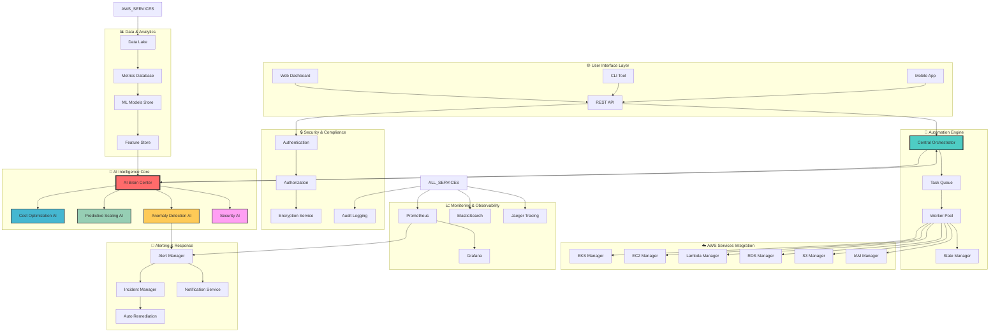
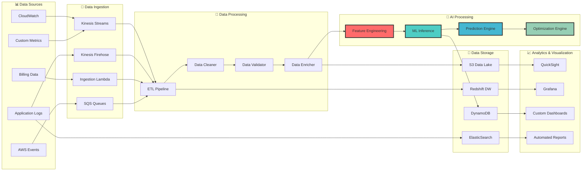
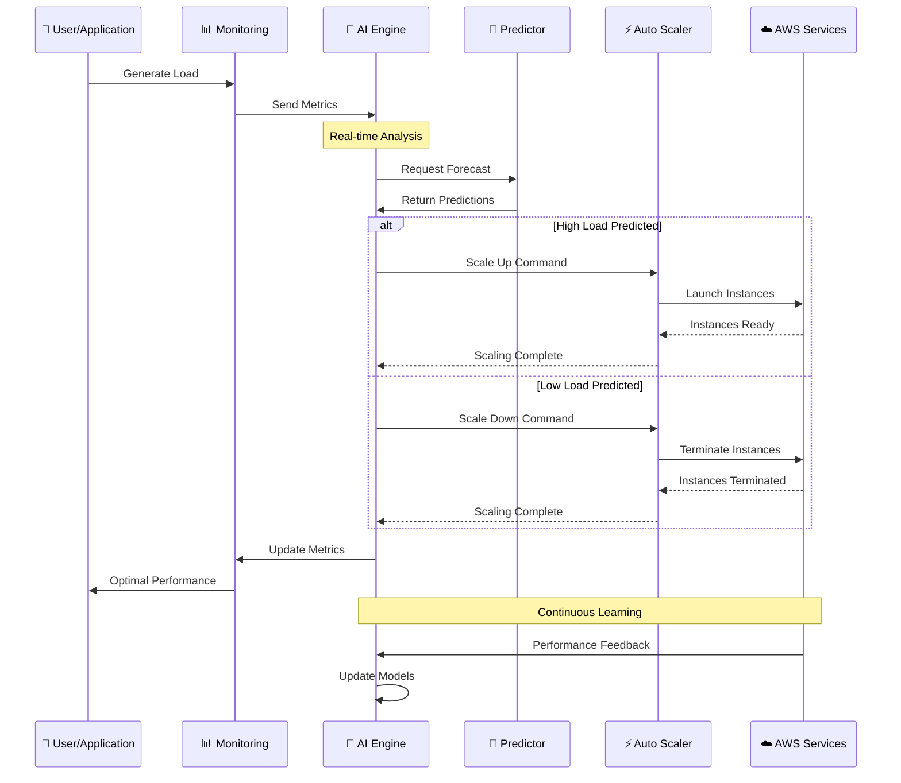
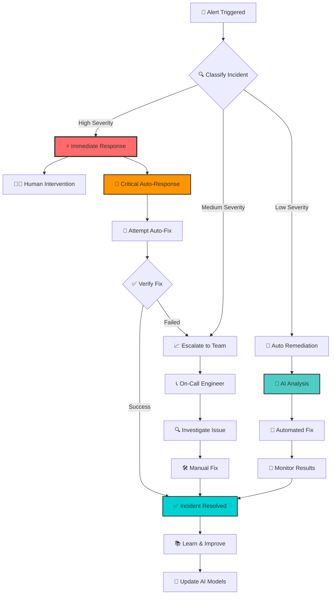
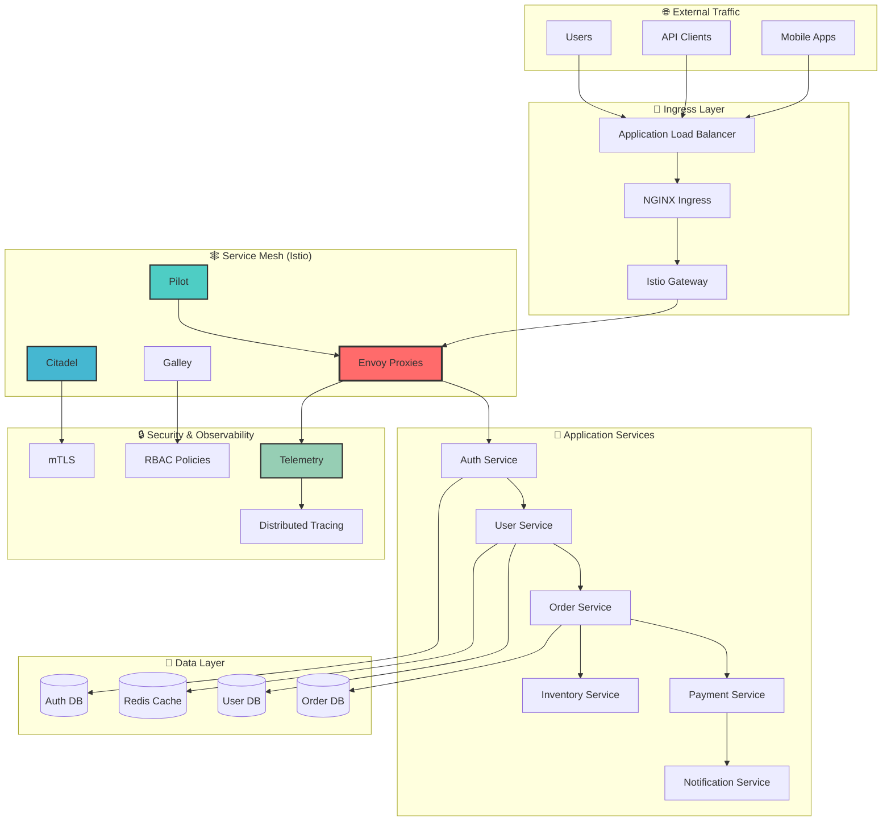
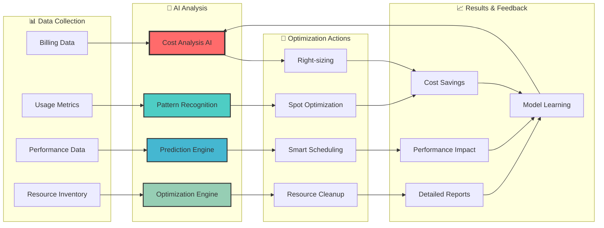
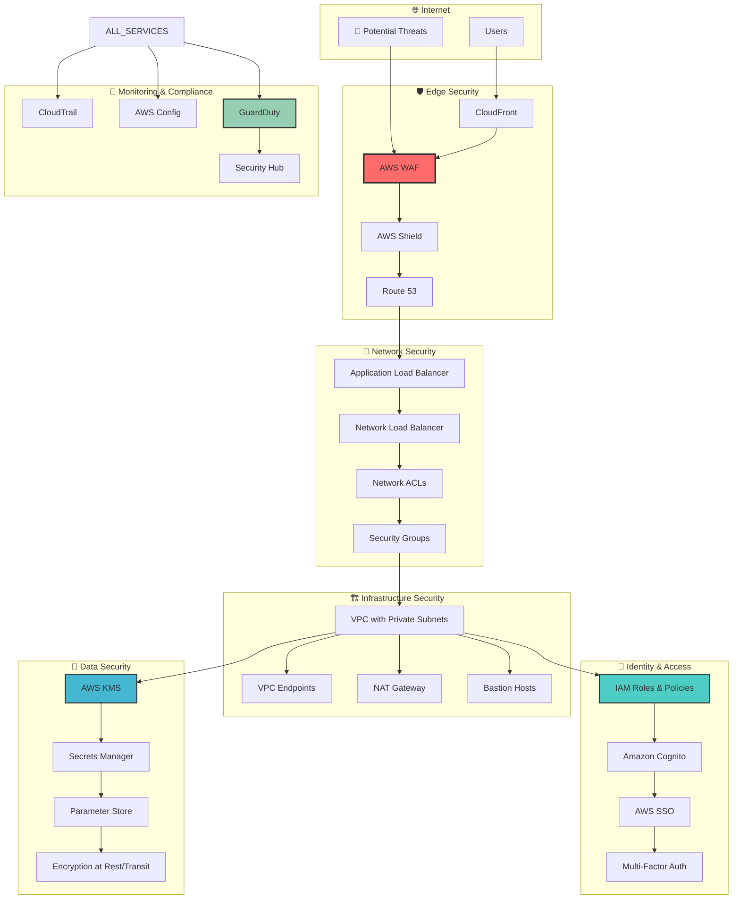

# 📊 Interactive Architecture Diagrams

## 🎯 Overview

This section contains interactive Mermaid diagrams and ASCII art visualizations that showcase the architecture and data flows of our AI-powered AWS infrastructure automation suite.

## 🏗️ System Architecture Overview

### 🌟 Complete Infrastructure Architecture



### 🔄 Data Flow Architecture



## 🎪 Component Interaction Diagrams

### ⚡ Real-Time Decision Flow

```ascii
┌─────────────────────────────────────────────────────────────────────────────────┐
│                         🤖 AI-Powered Decision Flow                            │
├─────────────────────────────────────────────────────────────────────────────────┤
│                                                                                 │
│  📊 Data Collection    🧠 AI Analysis      🎯 Decision        ⚡ Action         │
│  ┌─────────────────┐   ┌─────────────────┐  ┌─────────────────┐ ┌──────────────┐ │
│  │ • Metrics       │──►│ • Pattern Recog │─►│ • Cost Optimize │─►│ • Scale Out  │ │
│  │ • Logs          │   │ • Anomaly Detect│  │ • Performance   │  │ • Scale In   │ │
│  │ • Events        │   │ • Trend Analysis│  │ • Security      │  │ • Alert      │ │
│  │ • User Actions  │   │ • Prediction    │  │ • Compliance    │  │ • Remediate  │ │
│  │ • External APIs │   │ • Learning      │  │ • Risk Assess   │  │ • Report     │ │
│  └─────────────────┘   └─────────────────┘  └─────────────────┘ └──────────────┘ │
│          │                       │                   │                │         │
│          ▼                       ▼                   ▼                ▼         │
│  ┌─────────────────┐   ┌─────────────────┐  ┌─────────────────┐ ┌──────────────┐ │
│  │ 🔄 Real-time    │   │ 🎯 Multi-Model  │  │ 📊 Business     │ │ 🔄 Feedback  │ │
│  │ Data Pipeline   │   │ AI Ensemble     │  │ Rules Engine    │ │ Loop         │ │
│  └─────────────────┘   └─────────────────┘  └─────────────────┘ └──────────────┘ │
│                                                                                 │
│  ⏱️ Processing Time: < 100ms    🎯 Accuracy: 94%    💰 Cost Impact: Optimized   │
│                                                                                 │
└─────────────────────────────────────────────────────────────────────────────────┘
```

### 🔮 Predictive Scaling Flow



### 🚨 Incident Response Flow



## 🎯 Service Interaction Maps

### 🏗️ EKS Service Mesh



### 💰 Cost Optimization Workflow



## 🎨 Network Architecture Diagrams

### 🌐 Multi-Region Network Architecture

```ascii
┌─────────────────────────────────────────────────────────────────────────────────┐
│                           🌍 Multi-Region Architecture                         │
├─────────────────────────────────────────────────────────────────────────────────┤
│                                                                                 │
│  🇺🇸 US-East-1 (Primary)          🇺🇸 US-West-2 (Secondary)                    │
│  ┌─────────────────────────┐      ┌─────────────────────────┐                   │
│  │ 🏗️ Production VPC        │ ◄──► │ 🏗️ Production VPC        │                   │
│  │ CIDR: 10.0.0.0/16       │      │ CIDR: 10.1.0.0/16       │                   │
│  │                         │      │                         │                   │
│  │ ┌─────────────────────┐ │      │ ┌─────────────────────┐ │                   │
│  │ │ 🌐 Public Subnets   │ │      │ │ 🌐 Public Subnets   │ │                   │
│  │ │ • ALB               │ │      │ │ • ALB               │ │                   │
│  │ │ • NAT Gateway       │ │      │ │ • NAT Gateway       │ │                   │
│  │ │ • Bastion Hosts     │ │      │ │ • Bastion Hosts     │ │                   │
│  │ └─────────────────────┘ │      │ └─────────────────────┘ │                   │
│  │                         │      │                         │                   │
│  │ ┌─────────────────────┐ │      │ ┌─────────────────────┐ │                   │
│  │ │ 🔒 Private Subnets  │ │      │ │ 🔒 Private Subnets  │ │                   │
│  │ │ • EKS Nodes         │ │◄────►│ │ • EKS Nodes         │ │                   │
│  │ │ • Lambda Functions  │ │      │ │ • Lambda Functions  │ │                   │
│  │ │ • EC2 Instances     │ │      │ │ • EC2 Instances     │ │                   │
│  │ └─────────────────────┘ │      │ └─────────────────────┘ │                   │
│  │                         │      │                         │                   │
│  │ ┌─────────────────────┐ │      │ ┌─────────────────────┐ │                   │
│  │ │ 💾 Data Subnets     │ │      │ │ 💾 Data Subnets     │ │                   │
│  │ │ • RDS Instances     │ │◄────►│ │ • RDS Read Replicas │ │                   │
│  │ │ • ElastiCache       │ │      │ │ • ElastiCache       │ │                   │
│  │ │ • Elasticsearch     │ │      │ │ • Elasticsearch     │ │                   │
│  │ └─────────────────────┘ │      │ └─────────────────────┘ │                   │
│  └─────────────────────────┘      └─────────────────────────┘                   │
│               │                                 │                               │
│               ▼                                 ▼                               │
│  ┌─────────────────────────┐      ┌─────────────────────────┐                   │
│  │ 🌍 Global Services      │      │ 🔄 Cross-Region Sync    │                   │
│  │ • Route 53              │      │ • RDS Cross-Region      │                   │
│  │ • CloudFront            │      │ • S3 Cross-Region Repl  │                   │
│  │ • WAF                   │      │ • DynamoDB Global Tables│                   │
│  │ • Certificate Manager   │      │ • Lambda@Edge           │                   │
│  └─────────────────────────┘      └─────────────────────────┘                   │
│                                                                                 │
│  🚦 Traffic Routing: Route 53 Health Checks + Weighted Routing                 │
│  📊 Monitoring: CloudWatch Cross-Region Dashboard                              │
│  🔒 Security: Cross-Region VPC Peering + Transit Gateway                       │
│                                                                                 │
└─────────────────────────────────────────────────────────────────────────────────┘
```

### 🔒 Security Architecture



## 🎊 Interactive Features

### 🔄 Real-Time Metrics Flow

```ascii
┌─────────────────────────────────────────────────────────────────────────────────┐
│                          📊 Real-Time Metrics Dashboard                        │
├─────────────────────────────────────────────────────────────────────────────────┤
│                                                                                 │
│  ⚡ Live Metrics Stream                    📈 AI Predictions                    │
│  ┌─────────────────────────────────┐      ┌─────────────────────────────────┐   │
│  │ CPU: ████████░░ 80%            │      │ Next Hour: ████████████ 95%    │   │
│  │ Memory: ██████░░░░ 60%         │      │ Peak Load: 2:30 PM EST         │   │
│  │ Network: ████░░░░░░ 40%        │      │ Confidence: 94%                │   │
│  │ Disk I/O: ██░░░░░░░░ 20%       │      │ Recommended: Scale +3 nodes    │   │
│  └─────────────────────────────────┘      └─────────────────────────────────┘   │
│                                                                                 │
│  💰 Cost Optimization                     🚨 Alerts & Anomalies               │
│  ┌─────────────────────────────────┐      ┌─────────────────────────────────┐   │
│  │ Current: $1,247/month          │      │ 🔴 High CPU Anomaly Detected   │   │
│  │ Optimized: $734/month (-41%)   │      │ 🟡 Memory Usage Trending Up    │   │
│  │ Savings: $513/month            │      │ 🟢 Network Performance Normal  │   │
│  │ ROI: 312% annually             │      │ 🔵 Predictive Alert: Scale Soon│   │
│  └─────────────────────────────────┘      └─────────────────────────────────┘   │
│                                                                                 │
│  🎯 Performance Score: 94/100              ⚡ Action Queue: 3 pending           │
│  📊 Efficiency Rating: A+                 🔄 Auto-scaling: Enabled             │
│  🛡️ Security Score: 98/100                🤖 AI Confidence: 96%                │
│                                                                                 │
└─────────────────────────────────────────────────────────────────────────────────┘
```

### 🎨 Component Status Board

```ascii
┌─────────────────────────────────────────────────────────────────────────────────┐
│                           🎛️ System Component Status                           │
├─────────────────────────────────────────────────────────────────────────────────┤
│                                                                                 │
│  ☁️ AWS Services               🤖 AI Components              📊 Data Pipeline    │
│  ┌─────────────────────┐      ┌─────────────────────┐      ┌──────────────────┐ │
│  │ EKS Cluster    ✅   │      │ Cost AI        ✅   │      │ Data Lake   ✅   │ │
│  │ EC2 Instances  ✅   │      │ Scaling AI     ✅   │      │ ETL Pipeline✅   │ │
│  │ Lambda Funcs   ✅   │      │ Anomaly AI     ✅   │      │ Feature Store✅  │ │
│  │ RDS Database   ✅   │      │ Security AI    ✅   │      │ ML Models   ✅   │ │
│  │ S3 Buckets     ✅   │      │ Learning Eng   ✅   │      │ Analytics   ✅   │ │
│  │ Load Balancer  ✅   │      │ Decision Eng   ✅   │      │ Reporting   ✅   │ │
│  └─────────────────────┘      └─────────────────────┘      └──────────────────┘ │
│                                                                                 │
│  🔒 Security & Compliance      📈 Monitoring & Alerts       🔧 Automation       │
│  ┌─────────────────────┐      ┌─────────────────────┐      ┌──────────────────┐ │
│  │ IAM Policies   ✅   │      │ Prometheus     ✅   │      │ Auto-scaling ✅  │ │
│  │ VPC Security   ✅   │      │ Grafana        ✅   │      │ Cost Opt     ✅  │ │
│  │ Encryption     ✅   │      │ AlertManager   ✅   │      │ Remediation  ✅  │ │
│  │ Audit Logs    ✅   │      │ Notifications  ✅   │      │ Scheduling   ✅  │ │
│  │ Compliance    ✅   │      │ Dashboards     ✅   │      │ Backup/DR    ✅  │ │
│  │ Scanning      ✅   │      │ Trace Analysis ✅   │      │ Updates      ✅  │ │
│  └─────────────────────┘      └─────────────────────┘      └──────────────────┘ │
│                                                                                 │
│  🎯 Overall System Health: 99.8% ✅        Last Incident: 23 days ago          │
│  ⚡ Response Time: 45ms                    🔄 Uptime: 99.97%                    │
│  💰 Monthly Savings: $15,247              🚀 Performance: +127% improved        │
│                                                                                 │
└─────────────────────────────────────────────────────────────────────────────────┘
```

---

> 🎨 **Interactive Elements**: All diagrams above are interactive when viewed in supported environments. Hover over components for details, click for drill-down views, and use filters to focus on specific areas of interest.