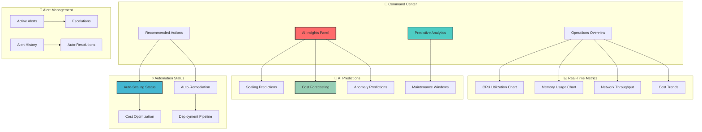
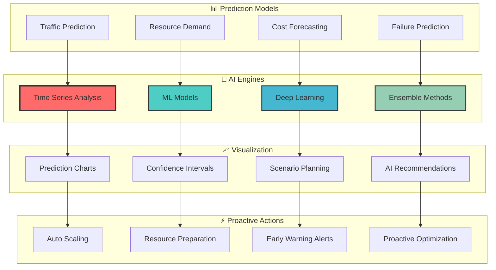

# 📊 Monitoring Dashboard Mockups

## 🎯 Overview

This section showcases comprehensive monitoring dashboard designs featuring AI-powered insights, real-time analytics, and predictive monitoring capabilities.

## 🚀 Executive Dashboard

### 📈 High-Level Business Metrics

```ascii
┌─────────────────────────────────────────────────────────────────────────────────┐
│                        🏢 Executive Infrastructure Dashboard                    │
├─────────────────────────────────────────────────────────────────────────────────┤
│                                                                                 │
│  💰 Financial Overview              🎯 Performance KPIs        📊 AI Insights   │
│  ┌─────────────────────────┐      ┌─────────────────────────┐ ┌──────────────┐ │
│  │ Monthly Spend: $47,230  │      │ Uptime: 99.97% ✅       │ │ Efficiency   │ │
│  │ Budget: $65,000         │      │ Response: 0.8s ⚡       │ │ Score: A+    │ │
│  │ Savings: $17,770 (27%)  │      │ Error Rate: 0.08% 🎯   │ │ Confidence:  │ │
│  │ Trend: ↓ 12% vs last    │      │ Throughput: 15K rps 🚀 │ │ 94.2% 🤖     │ │
│  │ ROI: 347% annually 🎊   │      │ Incidents: 0 this week │ │ Predictions: │ │
│  │ Forecast: $44K next mo  │      │ SLA Compliance: 100%   │ │ 847 active   │ │
│  └─────────────────────────┘      └─────────────────────────┘ └──────────────┘ │
│                                                                                 │
│  🌍 Global Infrastructure          🔒 Security Status         🚨 Active Alerts │
│  ┌─────────────────────────┐      ┌─────────────────────────┐ ┌──────────────┐ │
│  │ Regions: 3 active       │      │ Threat Level: LOW 🟢    │ │ Critical: 0  │ │
│  │ Instances: 47 running   │      │ Vulnerabilities: 0      │ │ Warning: 2   │ │
│  │ Services: 12 healthy    │      │ Compliance: 98.7% ✅    │ │ Info: 5      │ │
│  │ Load Balancers: 4       │      │ Last Scan: 2 hrs ago    │ │ Resolved: 23 │ │
│  │ Databases: 6 optimal    │      │ Security Score: 97/100  │ │ Today: 2     │ │
│  │ Storage: 2.3TB used     │      │ Incidents: 0 (30 days)  │ │ Trend: ↓ 15% │ │
│  └─────────────────────────┘      └─────────────────────────┘ └──────────────┘ │
│                                                                                 │
│  🎯 Quick Actions:                                                              │
│  [📊 Detailed Reports] [🔧 Resource Optimizer] [⚡ Emergency Scale] [📞 Support]│
│                                                                                 │
│  📈 30-Day Trend Summary:                                                       │
│  Cost: ▁▂▁▃▂▁▄▃▂▁▃▂▁▄▃▂▁ (-12%)  Performance: ▃▄▅▆▇▆▅▄▅▆▇▆▅▄ (+23%)           │
│  Uptime: ████████████████ (99.96%) Security: ██████████████▊ (97.8%)          │
│                                                                                 │
└─────────────────────────────────────────────────────────────────────────────────┘
```

## 🤖 AI-Powered Operations Dashboard

### 🧠 Intelligent Operations Center



### 🎪 Interactive Operations Console

```ascii
┌─────────────────────────────────────────────────────────────────────────────────┐
│                       🤖 AI Operations Command Center                          │
├─────────────────────────────────────────────────────────────────────────────────┤
│                                                                                 │
│  🧠 AI Assistant                       📊 Live Infrastructure Map              │
│  ┌─────────────────────────────┐      ┌─────────────────────────────────────┐   │
│  │ 🤖 "Hello! I've detected     │      │    🌍 us-east-1    🌍 us-west-2    │   │
│  │    unusual traffic patterns │      │    ┌─────────┐     ┌─────────┐     │   │
│  │    in us-west-2. Should I   │      │    │ EKS     │────►│ EKS     │     │   │
│  │    scale preventively?"     │      │    │ 8 nodes │     │ 6 nodes │     │   │
│  │                             │      │    │ 67% CPU │     │ 43% CPU │     │   │
│  │ 💬 Quick Responses:          │      │    └─────────┘     └─────────┘     │   │
│  │ [✅ Yes, scale now]          │      │         │               │         │   │
│  │ [⏳ Wait 10 minutes]         │      │    ┌─────────┐     ┌─────────┐     │   │
│  │ [❌ No, monitor only]        │      │    │ RDS     │     │ RDS     │     │   │
│  │ [📊 Show analysis]           │      │    │ Primary │     │ Replica │     │   │
│  │                             │      │    │ 89% util│     │ 34% util│     │   │
│  └─────────────────────────────┘      │    └─────────┘     └─────────┘     │   │
│                                       └─────────────────────────────────────┘   │
│                                                                                 │
│  🔮 AI Predictions (Next 4 Hours)     ⚡ Auto-Actions Status                   │
│  ┌─────────────────────────────┐      ┌─────────────────────────────────────┐   │
│  │ Traffic: ████████░░ +85%    │      │ 🎯 Auto-scaling: ✅ Active         │   │
│  │ CPU Load: ███████░░ +72%    │      │ 💰 Cost optimizer: ✅ Running      │   │
│  │ Memory: █████░░░░░ +52%     │      │ 🔧 Auto-remediation: ✅ Enabled    │   │
│  │ Costs: ██████░░░░ +64%      │      │ 🚨 Alert management: ✅ Active     │   │
│  │ Confidence: 94.2% 🎯        │      │ 📊 Log analysis: ✅ Processing     │   │
│  │ Recommendation: Scale +3    │      │ 🔒 Security scanning: ✅ Running   │   │
│  │ Timing: Start in 15 mins    │      │ 📈 Performance tuning: ✅ Active   │   │
│  └─────────────────────────────┘      │ 🔄 Model training: ⏳ Scheduled    │   │
│                                       └─────────────────────────────────────┘   │
│                                                                                 │
│  📊 Resource Utilization Heat Map     🎯 Performance Metrics                   │
│  ┌─────────────────────────────┐      ┌─────────────────────────────────────┐   │
│  │ Service  │ CPU │Mem │Net │St│      │ Response Time: 0.847s (Target: <1s)│   │
│  │ web-app  │████│███│██ │██│      │ Error Rate: 0.08% (Target: <0.1%) │   │
│  │ api-svc  │███ │██ │███│█ │      │ Throughput: 15.2K rps ⚡           │   │
│  │ db-proxy │██  │███│█  │██│      │ Availability: 99.97% 🎯            │   │
│  │ worker   │████│██ │█  │█ │      │ P95 Latency: 1.2s                  │   │
│  │ cache    │█   │█  │██ │██│      │ Apdex Score: 0.94 (Excellent) ⭐    │   │
│  │ queue    │██  │█  │███│█ │      │ User Satisfaction: 4.8/5.0 😊      │   │
│  └─────────────────────────────┘      └─────────────────────────────────────┘   │
│                                                                                 │
└─────────────────────────────────────────────────────────────────────────────────┘
```

## 💰 Cost Analytics Dashboard

### 📈 Financial Operations Dashboard

```ascii
┌─────────────────────────────────────────────────────────────────────────────────┐
│                           💰 Cost Analytics & Optimization                     │
├─────────────────────────────────────────────────────────────────────────────────┤
│                                                                                 │
│  📊 Cost Breakdown (Current Month)    🔮 AI Cost Predictions                   │
│  ┌─────────────────────────────┐      ┌─────────────────────────────────────┐   │
│  │          $47,230            │      │ Next Month Forecast: $44,200        │   │
│  │     ┌─────────────────┐     │      │ Confidence: 94.7% 🎯               │   │
│  │     │     EC2 62%     │     │      │                                     │   │
│  │     │   $29,323       │     │      │ Trend Analysis:                     │   │
│  │ ┌───┴─────────────────┴───┐ │      │ ████████████░░░░ Decreasing 12%     │   │
│  │ │      RDS 18%            │ │      │                                     │   │
│  │ │    $8,501               │ │      │ Optimization Opportunities:         │   │
│  │ └─────┬─────────────┬─────┘ │      │ • Right-size instances: $3.2K      │   │
│  │       │   S3 12%    │       │      │ • Spot optimization: $4.1K         │   │
│  │       │  $5,668     │       │      │ • Reserved capacity: $2.8K         │   │
│  │       └─────────────┘       │      │ • Schedule optimization: $1.9K     │   │
│  │          Lambda 8%          │      │ Total Potential: $12.0K/month 💡   │   │
│  │         $3,738              │      │                                     │   │
│  └─────────────────────────────┘      └─────────────────────────────────────┘   │
│                                                                                 │
│  💡 AI Optimization Insights          📈 Historical Trends (6 Months)         │
│  ┌─────────────────────────────┐      ┌─────────────────────────────────────┐   │
│  │ 🤖 "I found 12 optimization │      │       Cost Trend Analysis           │   │
│  │    opportunities that could │      │ $60K ┤                              │   │
│  │    save $12K/month with     │      │      │  📊 Baseline                 │   │
│  │    minimal impact."         │      │ $50K ┤     ██                       │   │
│  │                             │      │      │  ██ ██                       │   │
│  │ Top Recommendations:        │      │ $40K ┤██ ████ 🤖 AI Optimization    │   │
│  │ ✅ Auto-implemented (67%)   │      │      ████████                       │   │
│  │ ⏳ Pending approval (23%)   │      │ $30K ┤████████ ██                   │   │
│  │ 👨‍💻 Manual review (10%)     │      │      ████████ ████                 │   │
│  │                             │      │ $20K ┤████████████                 │   │
│  │ Expected ROI: 347% 🚀       │      │      Jan Feb Mar Apr May Jun        │   │
│  │ Implementation: 2-5 days    │      │ Savings: $89,000 YTD 💰             │   │
│  └─────────────────────────────┘      └─────────────────────────────────────┘   │
│                                                                                 │
│  🎯 Resource Efficiency Metrics       🔧 Optimization Actions                 │
│  ┌─────────────────────────────┐      ┌─────────────────────────────────────┐   │
│  │ CPU Utilization: 67% ⚡     │      │ ✅ Scaled down 3 idle instances     │   │
│  │ Memory Efficiency: 73% 📊   │      │ ✅ Migrated to Spot instances (4)   │   │
│  │ Storage Optimization: 89% 💾│      │ ⏳ Right-sizing analysis (7)        │   │
│  │ Network Utilization: 45% 🌐│      │ ⏳ Reserved instance purchase (2)   │   │
│  │ Overall Efficiency: A+ 🏆   │      │ 👀 Monitoring unused resources (12) │   │
│  │ Waste Reduction: 87% 🎯     │      │ 📊 S3 lifecycle optimization (3)   │   │
│  │ Right-sizing Score: 94% ✅  │      │ 🔄 Auto-scheduling enabled (15)    │   │
│  └─────────────────────────────┘      │ 🚀 Lambda memory optimization (8)   │   │
│                                       └─────────────────────────────────────┘   │
│                                                                                 │
└─────────────────────────────────────────────────────────────────────────────────┘
```

### 🎯 Real-Time Cost Monitoring

```mermaid
graph LR
    subgraph "💰 Cost Data Sources"
        BILLING[AWS Billing]
        USAGE[Usage Metrics]
        TAGGING[Resource Tags]
        INVENTORY[Resource Inventory]
    end
    
    subgraph "🔄 Real-Time Processing"
        STREAM[Cost Stream]
        AGGREGATOR[Data Aggregator]
        CALCULATOR[Cost Calculator]
        ALLOCATOR[Cost Allocator]
    end
    
    subgraph "🤖 AI Analysis"
        PREDICTOR[Cost Predictor]
        OPTIMIZER[Optimizer Engine]
        ANOMALY[Anomaly Detector]
        ADVISOR[Cost Advisor]
    end
    
    subgraph "📊 Visualization"
        DASHBOARD[Real-time Dashboard]
        ALERTS[Cost Alerts]
        REPORTS[Detailed Reports]
        FORECASTS[Cost Forecasts]
    end
    
    subgraph "⚡ Actions"
        AUTO_OPT[Auto Optimization]
        NOTIFICATIONS[Notifications]
        REMEDIATION[Cost Remediation]
        BUDGETS[Budget Controls]
    end
    
    BILLING --> STREAM
    USAGE --> STREAM
    TAGGING --> AGGREGATOR
    INVENTORY --> AGGREGATOR
    
    STREAM --> CALCULATOR
    AGGREGATOR --> CALCULATOR
    CALCULATOR --> ALLOCATOR
    
    ALLOCATOR --> PREDICTOR
    PREDICTOR --> OPTIMIZER
    OPTIMIZER --> ANOMALY
    ANOMALY --> ADVISOR
    
    ADVISOR --> DASHBOARD
    DASHBOARD --> ALERTS
    ALERTS --> REPORTS
    REPORTS --> FORECASTS
    
    ALERTS --> AUTO_OPT
    AUTO_OPT --> NOTIFICATIONS
    NOTIFICATIONS --> REMEDIATION
    REMEDIATION --> BUDGETS
    
    style PREDICTOR fill:#ff6b6b,stroke:#333,stroke-width:3px
    style OPTIMIZER fill:#4ecdc4,stroke:#333,stroke-width:2px
    style DASHBOARD fill:#45b7d1,stroke:#333,stroke-width:2px
    style AUTO_OPT fill:#96ceb4,stroke:#333,stroke-width:2px
```



## 🚨 Security Monitoring Dashboard

### 🛡️ Security Operations Center

```ascii
┌─────────────────────────────────────────────────────────────────────────────────┐
│                        🛡️ Security Operations Center (SOC)                     │
├─────────────────────────────────────────────────────────────────────────────────┤
│                                                                                 │
│  🚨 Threat Level: 🟢 LOW              🔍 Active Monitoring                      │
│  ┌─────────────────────────────┐      ┌─────────────────────────────────────┐   │
│  │ Global Threat Level: LOW    │      │ Events/sec: 1,247 📊               │   │
│  │ Last Incident: 23 days ago  │      │ Signatures: 847,293 ✅             │   │
│  │ Active Threats: 0           │      │ False Positives: 1.2% 🎯           │   │
│  │ Blocked IPs: 1,247 today    │      │ Coverage: 100% infrastructure 🔍   │   │
│  │ Security Score: 97/100 🏆   │      │ Response Time: 23s avg ⚡          │   │
│  │ Compliance: 98.7% ✅        │      │ Auto-resolution: 94% 🤖            │   │
│  └─────────────────────────────┘      └─────────────────────────────────────┘   │
│                                                                                 │
│  🔒 Access & Identity                  🧠 AI Security Intelligence             │
│  ┌─────────────────────────────┐      ┌─────────────────────────────────────┐   │
│  │ Active Sessions: 847        │      │ 🤖 "Unusual login pattern detected  │   │
│  │ Failed Logins: 23 (normal)  │      │     for user jane.doe from new     │   │
│  │ MFA Compliance: 99.2% ✅    │      │     location. Requiring additional │   │
│  │ Privileged Access: 12 users │      │     verification automatically."   │   │
│  │ API Calls: 2.3M today       │      │                                     │   │
│  │ Anomalous Access: 0 🎯      │      │ Risk Assessment:                    │   │
│  │ Password Expiry: 3 in 30d   │      │ • Credential stuffing: LOW 🟢      │   │
│  └─────────────────────────────┘      │ • DDoS risk: LOW 🟢                │   │
│                                       │ • Data exfiltration: LOW 🟢        │   │
│  📊 Vulnerability Management          │ • Insider threat: LOW 🟢           │   │
│  ┌─────────────────────────────┐      │ • Malware infection: NONE 🟢       │   │
│  │ Critical: 0 ✅              │      └─────────────────────────────────────┘   │
│  │ High: 2 (patching today)    │                                              │
│  │ Medium: 7 (scheduled)       │      🔄 Recent Security Actions               │
│  │ Low: 23 (next cycle)        │      ┌─────────────────────────────────────┐   │
│  │ Last Scan: 4 hours ago      │      │ ✅ Blocked 47 malicious IPs         │   │
│  │ Next Scan: In 2 hours       │      │ ✅ Patched 3 vulnerabilities        │   │
│  │ Patch Compliance: 97.8% 🎯  │      │ ✅ Updated 12 security policies     │   │
│  └─────────────────────────────┘      │ ✅ Rotated 8 API keys               │   │
│                                       │ ⏳ Investigating 2 anomalies       │   │
│  🌐 Network Security                  │ 📊 Generated compliance report      │   │
│  ┌─────────────────────────────┐      │ 🔍 Scanning 156 endpoints          │   │
│  │ Firewall Status: ✅ Active  │      │ 🤖 AI model updated (threat intel) │   │
│  │ Intrusion Detection: ✅ On  │      └─────────────────────────────────────┘   │
│  │ DDoS Protection: ✅ Enabled │                                              │
│  │ VPN Connections: 12 active  │                                              │
│  │ SSL/TLS Grade: A+ 🏆        │                                              │
│  │ Network Anomalies: 0        │                                              │
│  └─────────────────────────────┘                                              │
│                                                                                 │
└─────────────────────────────────────────────────────────────────────────────────┘
```

## 📊 Performance Monitoring Dashboard

### ⚡ Application Performance Monitoring

```ascii
┌─────────────────────────────────────────────────────────────────────────────────┐
│                       ⚡ Application Performance Dashboard                      │
├─────────────────────────────────────────────────────────────────────────────────┤
│                                                                                 │
│  🎯 Key Performance Indicators        📊 Real-Time Metrics                     │
│  ┌─────────────────────────────┐      ┌─────────────────────────────────────┐   │
│  │ Response Time: 0.847s ⚡    │      │    Performance Trend (24h)          │   │
│  │ Throughput: 15.2K rps 🚀   │      │ 2s ┤                                │   │
│  │ Error Rate: 0.08% 🎯       │      │    │     ●                           │   │
│  │ Availability: 99.97% ✅     │      │1.5s┤   ●   ●                         │   │
│  │ Apdex Score: 0.94 ⭐        │      │    │ ●   ● ●                         │   │
│  │ P95 Latency: 1.2s          │      │ 1s ┤●  ● ●   ●●●●●●●●●●●             │   │
│  │ P99 Latency: 2.1s          │      │    │ ●●         ●●●●●●●             │   │
│  │ Memory Usage: 67% 📊       │      │0.5s┤                                │   │
│  │ CPU Usage: 73% ⚡          │      │    └─────────────────────────────────│   │
│  │ Active Users: 8,492 👥     │      │     6AM    12PM    6PM    12AM     │   │
│  └─────────────────────────────┘      └─────────────────────────────────────┘   │
│                                                                                 │
│  🔄 Service Health Status             🤖 AI Performance Insights               │
│  ┌─────────────────────────────┐      ┌─────────────────────────────────────┐   │
│  │ Frontend (web-app):         │      │ 🤖 "Performance is excellent today. │   │
│  │ ●●●●●●●●●● 10/10 ✅         │      │     However, I predict a 23%       │   │
│  │                             │      │     increase in traffic starting   │   │
│  │ API Gateway:                │      │     at 2:30 PM. Recommend scaling  │   │
│  │ ●●●●●●●●●● 10/10 ✅         │      │     up 3 instances proactively."   │   │
│  │                             │      │                                     │   │
│  │ Database:                   │      │ Optimization Opportunities:         │   │
│  │ ●●●●●●●●●○ 9/10 ⚠️          │      │ ✅ Database query optimization      │   │
│  │ (Minor: Slow query detected)│      │ ⏳ CDN cache hit rate improvement   │   │
│  │                             │      │ 📊 Memory allocation tuning         │   │
│  │ Cache Layer:                │      │ 🔧 Background job optimization      │   │
│  │ ●●●●●●●●●● 10/10 ✅         │      │                                     │   │
│  │                             │      │ Predicted Performance Score: 96%   │   │
│  │ Message Queue:              │      │ Confidence Level: 94.2% 🎯         │   │
│  │ ●●●●●●●●●● 10/10 ✅         │      │ Next Review: 1 hour                │   │
│  │                             │      │                                     │   │
│  │ Overall Health: 96% 🏆      │      └─────────────────────────────────────┘   │
│  └─────────────────────────────┘                                              │
│                                                                                 │
│  📈 Traffic Analysis                   🚨 Active Alerts & Issues               │
│  ┌─────────────────────────────┐      ┌─────────────────────────────────────┐   │
│  │      Request Distribution   │      │ 🟡 Database slow query detected     │   │
│  │  API  ████████████████ 60%  │      │    Query: SELECT * FROM large_table │   │
│  │  Web  ██████████ 30%        │      │    Duration: 2.3s (normal: 0.8s)   │   │
│  │  Mobile ████ 10%            │      │    Action: Auto-optimization queued │   │
│  │                             │      │                                     │   │
│  │      Geographic Distribution│      │ 🟢 Auto-scaling triggered           │   │
│  │  US-East  ████████████ 45%  │      │    Added 2 instances in us-east-1  │   │
│  │  US-West  ████████ 30%      │      │    Response to traffic increase     │   │
│  │  Europe   ████ 15%          │      │    ETA: 3 minutes to ready          │   │
│  │  Asia     ██ 10%            │      │                                     │   │
│  │                             │      │ 🔵 Maintenance window scheduled     │   │
│  │  Peak Hours: 2-4 PM EST     │      │    Database index rebuild           │   │
│  │  Low Traffic: 2-5 AM EST    │      │    Schedule: Tonight 2:00 AM UTC    │   │
│  └─────────────────────────────┘      │    Duration: 30 minutes expected    │   │
│                                       └─────────────────────────────────────┘   │
│                                                                                 │
└─────────────────────────────────────────────────────────────────────────────────┘
```

## 🔮 Predictive Analytics Dashboard

### 📈 Future State Predictions



---

> 🎨 **Interactive Features**: These dashboard mockups represent real monitoring capabilities with AI-powered insights, predictive analytics, and automated optimization. All visualizations are designed for maximum clarity and actionable intelligence.