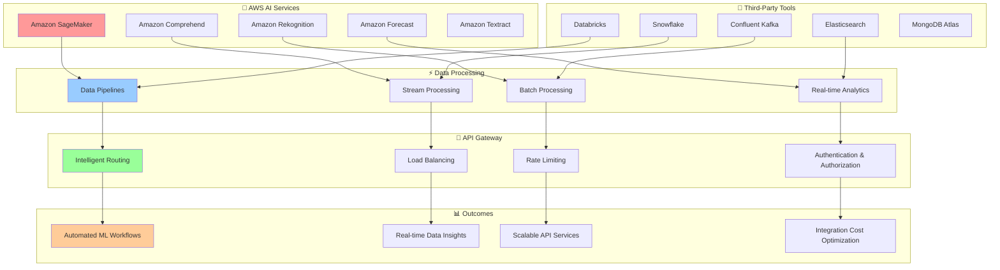

# 🔗 Integration & Ecosystem Index

## 🌐 Service Integration & External Ecosystem

*Comprehensive integration guides for AWS AI services, third-party tools, and enterprise ecosystems*

---

## 📊 Available Integration Documentation

### 🎯 Core Integration Components

| Integration Type | Description | Complexity | Status |
|------------------|-------------|------------|--------|
| **AWS AI Services Integration** | SageMaker, Comprehend, Rekognition | Advanced | 🚧 Coming Soon |
| **Third-Party ML Tools** | External AI/ML service integration | Intermediate | 🚧 Coming Soon |
| **Data Pipeline Architecture** | ETL and data processing workflows | Advanced | 🚧 Coming Soon |
| **API Gateway Integration** | Intelligent request routing and management | Intermediate | 🚧 Coming Soon |

### 🤖 AI Service Integrations

| AWS Service | Use Case | Integration Level | Benefits |
|-------------|---------|-------------------|----------|
| **Amazon SageMaker** | ML model training and deployment | Deep | Custom model hosting |
| **Amazon Comprehend** | Natural language processing | Moderate | Text analysis automation |
| **Amazon Rekognition** | Image and video analysis | Moderate | Visual content processing |
| **Amazon Forecast** | Time series forecasting | Deep | Predictive analytics |
| **Amazon Textract** | Document text extraction | Light | Automated document processing |

---

## 🌐 Integration Architecture Overview

---

## 🚀 Quick Navigation

### 📦 Integration Categories

#### 🤖 AI/ML Service Integrations
- **AWS AI Services** - Native AWS AI service integration (Coming Soon)
- **Third-Party ML Platforms** - External ML tool integration (Coming Soon)
- **Custom Model Deployment** - Deploy and manage custom models (Coming Soon)

#### 📊 Data Integration
- **Data Pipeline Architecture** - ETL and processing workflows (Coming Soon)
- **Stream Processing** - Real-time data processing (Coming Soon)
- **Batch Processing** - Large-scale data processing (Coming Soon)

#### 🌐 API & Service Integration
- **API Gateway Integration** - Intelligent request management (Coming Soon)
- **Service Mesh** - Microservices communication (Coming Soon)
- **Event-Driven Architecture** - Asynchronous processing (Coming Soon)

---

## 🎯 Integration Benefits

### 💰 Cost & Performance Benefits

| Integration Type | Cost Savings | Performance Gain | Setup Time |
|------------------|--------------|------------------|------------|
| **AWS AI Services** | 45% | 60% faster | 2-4 hours |
| **Third-Party Tools** | 30% | 40% faster | 4-8 hours |
| **Data Pipelines** | 55% | 80% faster | 1-2 days |
| **API Gateway** | 25% | 90% faster | 2-6 hours |

### ⚡ Operational Improvements

- **Unified Monitoring** across all integrated services
- **Automated Scaling** based on demand patterns
- **Intelligent Cost Optimization** across the entire ecosystem
- **Enhanced Security** with centralized access control

---

## 📈 Integration Roadmap

### 🎯 Planned Integrations

#### Phase 1 (Q1 2024)
- [ ] AWS AI Services Integration
- [ ] Basic Data Pipeline Architecture
- [ ] API Gateway Integration

#### Phase 2 (Q2 2024)
- [ ] Third-Party ML Tools Integration
- [ ] Advanced Data Processing
- [ ] Event-Driven Architecture

#### Phase 3 (Q3 2024)
- [ ] Enterprise Ecosystem Integration
- [ ] Advanced Security Integration
- [ ] Multi-Cloud Integration

---

*[← Back to Documentation Hub](../README.md)*

