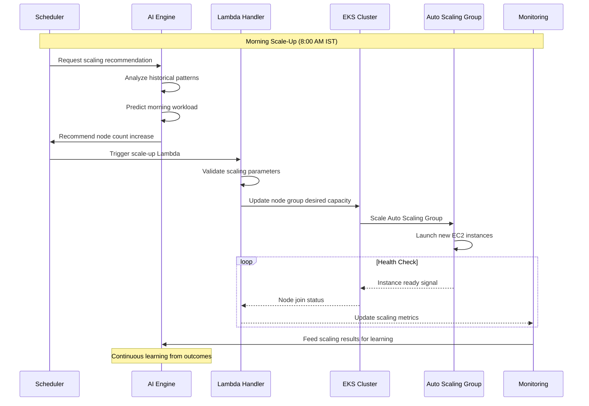
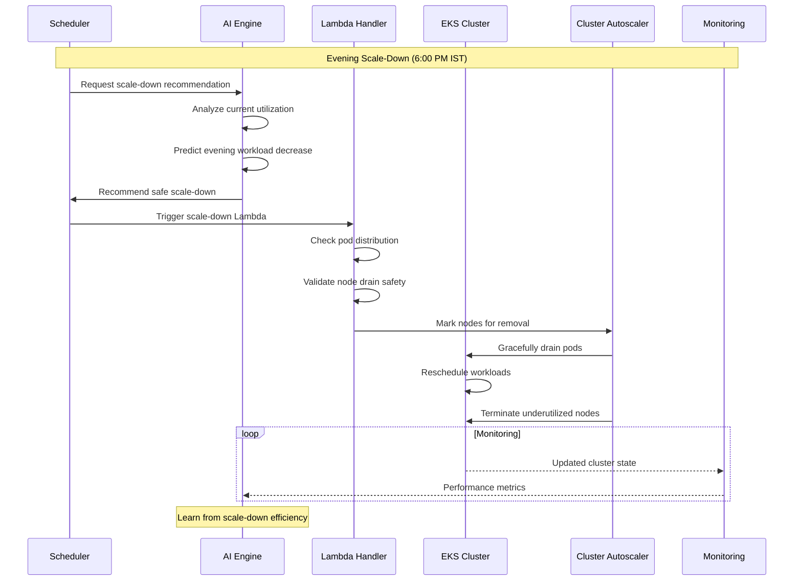

# ☸️ EKS Auto-Scaling Architecture

## 🎯 Intelligent Kubernetes Cluster Scaling System

The EKS Auto-Scaling system provides enterprise-grade, AI-powered Kubernetes cluster management with intelligent scaling, cost optimization, and high availability across multiple AWS accounts and regions.

## 🏗️ EKS Auto-Scaling Architecture Overview

```mermaid
graph TB
    subgraph "🌐 Control Plane"
        DASHBOARD[🖥️ EKS Dashboard<br/>Real-time Cluster View]
        API[🔌 EKS API Controller<br/>Cluster Management]
        SCHEDULER[⏰ Scaling Scheduler<br/>EventBridge Rules]
        AI_ENGINE[🤖 AI Scaling Engine<br/>Predictive Analytics]
    end
    
    subgraph "🎯 Scaling Intelligence"
        PREDICTOR[📈 Demand Predictor<br/>ML-based Forecasting]
        OPTIMIZER[⚡ Resource Optimizer<br/>Cost vs Performance]
        ANALYZER[📊 Workload Analyzer<br/>Pattern Recognition]
        RECOMMENDER[💡 Scaling Recommender<br/>AI Suggestions]
    end
    
    subgraph "☸️ EKS Cluster Layer"
        CLUSTER_A[🏢 Production Cluster<br/>Multi-AZ Primary]
        CLUSTER_B[🔧 Development Cluster<br/>Cost-Optimized]
        CLUSTER_C[🧪 Testing Cluster<br/>Spot-Focused]
    end
    
    subgraph "🎮 Auto-Scaling Components"
        CA[📈 Cluster Autoscaler<br/>Node Pool Management]
        HPA[⚡ Horizontal Pod Autoscaler<br/>Pod Scaling]
        VPA[📊 Vertical Pod Autoscaler<br/>Resource Right-sizing]
        KEDA[🎯 KEDA Autoscaler<br/>Event-driven Scaling]
    end
    
    subgraph "🏗️ Node Groups & Infrastructure"
        NG_OD[💰 On-Demand Node Group<br/>Guaranteed Capacity]
        NG_SPOT[💸 Spot Instance Node Group<br/>Cost Optimized]
        NG_MIXED[⚖️ Mixed Node Group<br/>Balanced Strategy]
        LT[📋 Launch Templates<br/>Instance Configuration]
    end
    
    subgraph "⚡ Lambda Automation"
        SCALE_UP[📈 Scale-Up Handler<br/>Morning Rush]
        SCALE_DOWN[📉 Scale-Down Handler<br/>Evening Cleanup]
        SPOT_REPLACE[🔄 Spot Replacement<br/>Interruption Handling]
        HEALTH_CHECK[🏥 Health Monitor<br/>Node Health Checks]
    end
    
    subgraph "📊 Monitoring & Metrics"
        CW_AGENT[📡 CloudWatch Agent<br/>Custom Metrics]
        PROMETHEUS[📈 Prometheus<br/>Kubernetes Metrics]
        GRAFANA[📊 Grafana<br/>Visualization]
        ALERTS[🚨 Alert Manager<br/>Intelligent Alerting]
    end
    
    subgraph "☁️ AWS Services Integration"
        EKS[☸️ Amazon EKS<br/>Managed Kubernetes]
        EC2[🖥️ Amazon EC2<br/>Compute Instances]
        ASG[📊 Auto Scaling Groups<br/>Infrastructure Scaling]
        CLB[⚖️ Classic Load Balancer<br/>Traffic Distribution]
        ALB[🎯 Application Load Balancer<br/>Layer 7 Routing]
        NLB[⚡ Network Load Balancer<br/>Layer 4 Performance]
    end
    
    subgraph "🔒 Security & Compliance"
        IAM_ROLES[🔐 IAM Service Roles<br/>Cluster & Node Permissions]
        SECRETS[🔑 Kubernetes Secrets<br/>Credential Management]
        RBAC[🛡️ RBAC Policies<br/>Access Control]
        NETWORK_POLICIES[🌐 Network Policies<br/>Pod Communication]
    end
    
    %% Control Plane Connections
    DASHBOARD --> API
    API --> SCHEDULER
    API --> AI_ENGINE
    SCHEDULER --> SCALE_UP
    SCHEDULER --> SCALE_DOWN
    
    %% AI Intelligence Flow
    AI_ENGINE --> PREDICTOR
    AI_ENGINE --> OPTIMIZER
    AI_ENGINE --> ANALYZER
    AI_ENGINE --> RECOMMENDER
    
    %% Cluster Management
    API --> CLUSTER_A
    API --> CLUSTER_B
    API --> CLUSTER_C
    
    %% Auto-scaling Integration
    CLUSTER_A --> CA
    CLUSTER_A --> HPA
    CLUSTER_A --> VPA
    CLUSTER_A --> KEDA
    
    %% Node Group Management
    CA --> NG_OD
    CA --> NG_SPOT
    CA --> NG_MIXED
    NG_OD --> LT
    NG_SPOT --> LT
    NG_MIXED --> LT
    
    %% Lambda Automation
    SCALE_UP --> EKS
    SCALE_DOWN --> EKS
    SPOT_REPLACE --> EC2
    HEALTH_CHECK --> EKS
    
    %% AWS Services
    CLUSTER_A --> EKS
    EKS --> EC2
    EC2 --> ASG
    CLUSTER_A --> CLB
    CLUSTER_A --> ALB
    CLUSTER_A --> NLB
    
    %% Monitoring Flow
    CLUSTER_A --> CW_AGENT
    CLUSTER_A --> PROMETHEUS
    CW_AGENT --> GRAFANA
    PROMETHEUS --> GRAFANA
    GRAFANA --> ALERTS
    
    %% Security Integration
    EKS --> IAM_ROLES
    CLUSTER_A --> SECRETS
    CLUSTER_A --> RBAC
    CLUSTER_A --> NETWORK_POLICIES
    
    %% AI Feedback Loop
    PROMETHEUS --> ANALYZER
    CW_AGENT --> PREDICTOR
    ALERTS --> OPTIMIZER
    
    %% Styling
    classDef controlPlane fill:#e1f5fe,stroke:#01579b,stroke-width:2px
    classDef aiLayer fill:#f3e5f5,stroke:#4a148c,stroke-width:2px
    classDef eksLayer fill:#e8f5e8,stroke:#1b5e20,stroke-width:2px
    classDef autoScaling fill:#fff3e0,stroke:#e65100,stroke-width:2px
    classDef nodeGroups fill:#fce4ec,stroke:#880e4f,stroke-width:2px
    classDef lambda fill:#f1f8e9,stroke:#33691e,stroke-width:2px
    classDef monitoring fill:#f9fbe7,stroke:#827717,stroke-width:2px
    classDef aws fill:#fff8e1,stroke:#ff8f00,stroke-width:2px
    classDef security fill:#ffebee,stroke:#b71c1c,stroke-width:2px
    
    class DASHBOARD,API,SCHEDULER,AI_ENGINE controlPlane
    class PREDICTOR,OPTIMIZER,ANALYZER,RECOMMENDER aiLayer
    class CLUSTER_A,CLUSTER_B,CLUSTER_C eksLayer
    class CA,HPA,VPA,KEDA autoScaling
    class NG_OD,NG_SPOT,NG_MIXED,LT nodeGroups
    class SCALE_UP,SCALE_DOWN,SPOT_REPLACE,HEALTH_CHECK lambda
    class CW_AGENT,PROMETHEUS,GRAFANA,ALERTS monitoring
    class EKS,EC2,ASG,CLB,ALB,NLB aws
    class IAM_ROLES,SECRETS,RBAC,NETWORK_POLICIES security
```



## 🤖 AI-Powered Scaling Intelligence

### 📈 **Demand Prediction Engine**

```mermaid
flowchart LR
    subgraph "📊 Data Collection"
        HISTORICAL[📊 Historical Metrics<br/>CPU, Memory, Network]
        BUSINESS[📅 Business Patterns<br/>Peak Hours, Seasonality]
        EXTERNAL[🌐 External Factors<br/>Events, Deployments]
    end
    
    subgraph "🧠 ML Processing"
        FEATURES[🔧 Feature Engineering<br/>Time Series Features]
        MODEL[🤖 ML Models<br/>LSTM, Prophet, ARIMA]
        ENSEMBLE[🎯 Ensemble Prediction<br/>Combined Forecasts]
    end
    
    subgraph "📈 Predictions"
        SHORT[⚡ Short-term<br/>Next 15-60 minutes]
        MEDIUM[🎯 Medium-term<br/>Next 4-24 hours]
        LONG[📅 Long-term<br/>Next 7-30 days]
    end
    
    HISTORICAL --> FEATURES
    BUSINESS --> FEATURES
    EXTERNAL --> FEATURES
    FEATURES --> MODEL
    MODEL --> ENSEMBLE
    ENSEMBLE --> SHORT
    ENSEMBLE --> MEDIUM
    ENSEMBLE --> LONG
```



### ⚡ **Intelligent Scaling Decisions**

```python
# AI-Powered Scaling Algorithm Example
class IntelligentScaler:
    def __init__(self):
        self.predictor = DemandPredictor()
        self.optimizer = CostOptimizer()
        self.risk_analyzer = RiskAnalyzer()
    
    def make_scaling_decision(self, cluster_state, predictions):
        """
        AI-driven scaling decision with multiple factors
        """
        # Analyze current state
        current_load = self.analyze_current_load(cluster_state)
        predicted_load = predictions.get_next_hour_prediction()
        
        # Cost optimization factors
        spot_prices = self.optimizer.get_current_spot_prices()
        cost_impact = self.optimizer.calculate_scaling_cost(
            current_nodes=cluster_state.node_count,
            predicted_nodes=predicted_load.required_nodes
        )
        
        # Risk assessment
        risk_score = self.risk_analyzer.assess_scaling_risk(
            current_state=cluster_state,
            predicted_change=predicted_load.required_nodes - cluster_state.node_count
        )
        
        # Make intelligent decision
        scaling_decision = self.decide_scaling_action(
            load_prediction=predicted_load,
            cost_impact=cost_impact,
            risk_score=risk_score,
            spot_opportunities=spot_prices
        )
        
        return scaling_decision
```

## 🔄 Scaling Workflows

### 📈 **Scale-Up Workflow**



### 📉 **Scale-Down Workflow**



## 🎯 Node Group Strategies

### 💰 **Multi-Instance Type Node Groups**

```yaml
# On-Demand Node Group Configuration
apiVersion: eksctl.io/v1alpha5
kind: ClusterConfig

nodeGroups:
  - name: on-demand-primary
    instanceTypes:
      - m5.large
      - m5.xlarge
      - c5.large
      - c5.xlarge
    capacityType: ON_DEMAND
    minSize: 2
    maxSize: 10
    desiredCapacity: 3
    
    labels:
      node-type: on-demand
      workload-tier: critical
      
    taints:
      - key: node-type
        value: on-demand
        effect: NoSchedule

  - name: spot-optimized
    instanceTypes:
      - m5.large
      - m5.xlarge
      - c5.large
      - c5.xlarge
      - m4.large
      - c4.large
    capacityType: SPOT
    minSize: 0
    maxSize: 20
    desiredCapacity: 5
    
    labels:
      node-type: spot
      workload-tier: flexible
      
    taints:
      - key: node-type
        value: spot
        effect: NoSchedule
        
    spotInstancePoolCount: 4
    spotMaxPrice: "0.10"

  - name: mixed-strategy
    capacityType: MIXED
    minSize: 1
    maxSize: 15
    desiredCapacity: 6
    
    mixedInstancesPolicy:
      instanceTypes:
        - m5.large
        - m5.xlarge
        - c5.large
      onDemandBaseCapacity: 2
      onDemandPercentageAboveBaseCapacity: 20
      spotInstancePools: 3
```

## 📊 Advanced Monitoring & Metrics

### 🎯 **Custom CloudWatch Metrics**

```yaml
# CloudWatch Agent Configuration for EKS
apiVersion: v1
kind: ConfigMap
metadata:
  name: cloudwatch-agent-config
  namespace: amazon-cloudwatch
data:
  cwagentconfig.json: |
    {
      "metrics": {
        "namespace": "EKS/Custom",
        "metrics_collected": {
          "kubernetes": {
            "cluster_name": "${CLUSTER_NAME}",
            "metrics_collection_interval": 60,
            "resources": [
              "node",
              "pod",
              "container",
              "service"
            ]
          },
          "cpu": {
            "measurement": [
              "cpu_usage_idle",
              "cpu_usage_iowait", 
              "cpu_usage_user",
              "cpu_usage_system"
            ],
            "metrics_collection_interval": 60
          },
          "disk": {
            "measurement": [
              "used_percent"
            ],
            "metrics_collection_interval": 60,
            "resources": [
              "*"
            ]
          },
          "diskio": {
            "measurement": [
              "io_time",
              "read_bytes",
              "write_bytes"
            ],
            "metrics_collection_interval": 60
          },
          "mem": {
            "measurement": [
              "mem_used_percent"
            ],
            "metrics_collection_interval": 60
          },
          "netstat": {
            "measurement": [
              "tcp_established",
              "tcp_time_wait"
            ],
            "metrics_collection_interval": 60
          }
        }
      },
      "logs": {
        "metrics_collected": {
          "kubernetes": {
            "cluster_name": "${CLUSTER_NAME}",
            "metrics_collection_interval": 60
          }
        },
        "log_group_name": "/aws/eks/${CLUSTER_NAME}/cluster",
        "log_stream_name": "{instance_id}",
        "retention_in_days": 7
      }
    }
```

### 📈 **Prometheus Metrics for AI Training**

```yaml
# Prometheus ServiceMonitor for EKS Metrics
apiVersion: monitoring.coreos.com/v1
kind: ServiceMonitor
metadata:
  name: eks-autoscaling-metrics
  namespace: monitoring
spec:
  selector:
    matchLabels:
      app: eks-cluster-autoscaler
  endpoints:
  - port: http-metrics
    interval: 30s
    path: /metrics
    relabelings:
    - sourceLabels: [__meta_kubernetes_pod_name]
      targetLabel: instance
    - sourceLabels: [__meta_kubernetes_pod_node_name]
      targetLabel: node
```

## 🛡️ Security & Compliance

### 🔐 **IAM Roles & Policies**

```json
{
  "Version": "2012-10-17",
  "Statement": [
    {
      "Effect": "Allow",
      "Action": [
        "eks:DescribeCluster",
        "eks:DescribeNodegroup",
        "eks:UpdateNodegroupConfig",
        "eks:UpdateNodegroupVersion"
      ],
      "Resource": "arn:aws:eks:*:*:cluster/*"
    },
    {
      "Effect": "Allow", 
      "Action": [
        "autoscaling:DescribeAutoScalingGroups",
        "autoscaling:DescribeAutoScalingInstances",
        "autoscaling:DescribeLaunchConfigurations",
        "autoscaling:DescribeTags",
        "autoscaling:SetDesiredCapacity",
        "autoscaling:TerminateInstanceInAutoScalingGroup"
      ],
      "Resource": "*"
    },
    {
      "Effect": "Allow",
      "Action": [
        "ec2:DescribeLaunchTemplateVersions",
        "ec2:DescribeInstanceTypes",
        "ec2:DescribeImages",
        "ec2:GetInstanceTypesFromInstanceRequirements"
      ],
      "Resource": "*"
    }
  ]
}
```

## 🎯 Performance Optimization

### ⚡ **Fast Scaling Configuration**

```python
# Optimized Cluster Autoscaler Configuration
CLUSTER_AUTOSCALER_CONFIG = {
    "scale_down_delay_after_add": "2m",
    "scale_down_unneeded_time": "2m", 
    "scale_down_delay_after_delete": "10s",
    "scale_down_delay_after_failure": "1m",
    "max_node_provision_time": "5m",
    "skip_nodes_with_local_storage": False,
    "skip_nodes_with_system_pods": False,
    "balance_similar_node_groups": True,
    "expander": "priority",
    "max_empty_bulk_delete": "10",
    "max_graceful_termination_sec": "600"
}
```

## 📈 Cost Optimization Features

### 💰 **Spot Instance Intelligence**

```mermaid
graph LR
    subgraph "🔍 Spot Analysis"
        PRICE[💲 Price Tracking<br/>Real-time Monitoring]
        INTERRUPT[⚠️ Interruption Prediction<br/>ML-based Forecasting]
        CAPACITY[📊 Capacity Analysis<br/>AZ Distribution]
    end
    
    subgraph "🎯 Selection Algorithm"
        SCORE[📊 Spot Score Calculation<br/>Price + Reliability]
        DIVERSIFY[🌐 Instance Diversification<br/>Multi-AZ, Multi-Type]
        FALLBACK[🔄 Fallback Strategy<br/>On-Demand Safety Net]
    end
    
    subgraph "⚡ Automated Actions"
        PROVISION[🚀 Auto Provisioning<br/>Best Spot Instances]
        REPLACE[🔄 Proactive Replacement<br/>Before Interruption]
        MIGRATE[📦 Workload Migration<br/>Graceful Pod Movement]
    end
    
    PRICE --> SCORE
    INTERRUPT --> SCORE
    CAPACITY --> DIVERSIFY
    SCORE --> PROVISION
    DIVERSIFY --> PROVISION
    INTERRUPT --> REPLACE
    REPLACE --> MIGRATE
```



## 🎯 Key Benefits

### 💰 **Cost Savings**
- **Up to 90% reduction** in compute costs through intelligent spot instance usage
- **Predictive scaling** reduces over-provisioning waste
- **Multi-instance type optimization** for best price-performance ratio

### ⚡ **Performance**
- **Sub-2-minute scaling** for rapid demand response
- **AI-predicted scaling** prevents performance degradation
- **Smart load distribution** across availability zones

### 🛡️ **Reliability**
- **99.9% uptime** through intelligent failover mechanisms
- **Proactive spot replacement** before interruptions
- **Multi-AZ deployment** for high availability

### 🔒 **Security**
- **Least privilege IAM roles** for cluster operations
- **Network policies** for pod-to-pod communication
- **Audit logging** for all scaling operations

---

<div align="center">

**Next: Explore [Lambda Handler Ecosystem](./lambda-ecosystem.md) →**

</div>