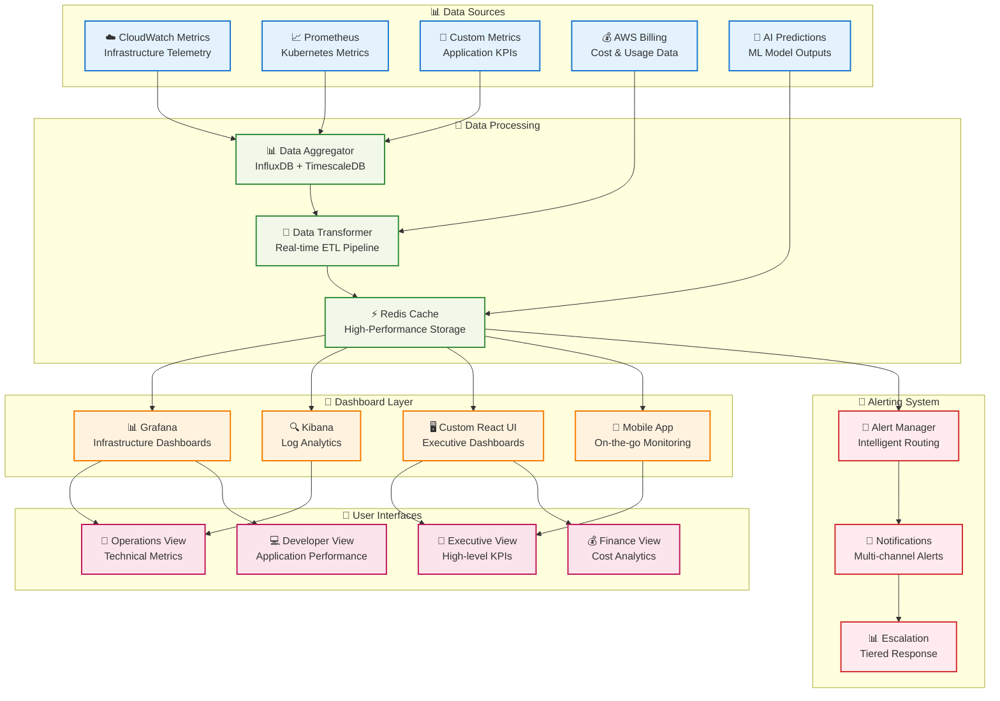
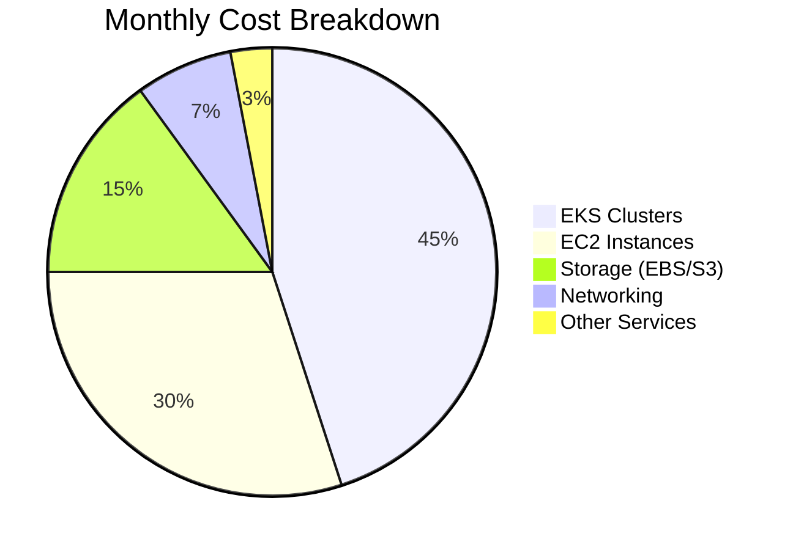
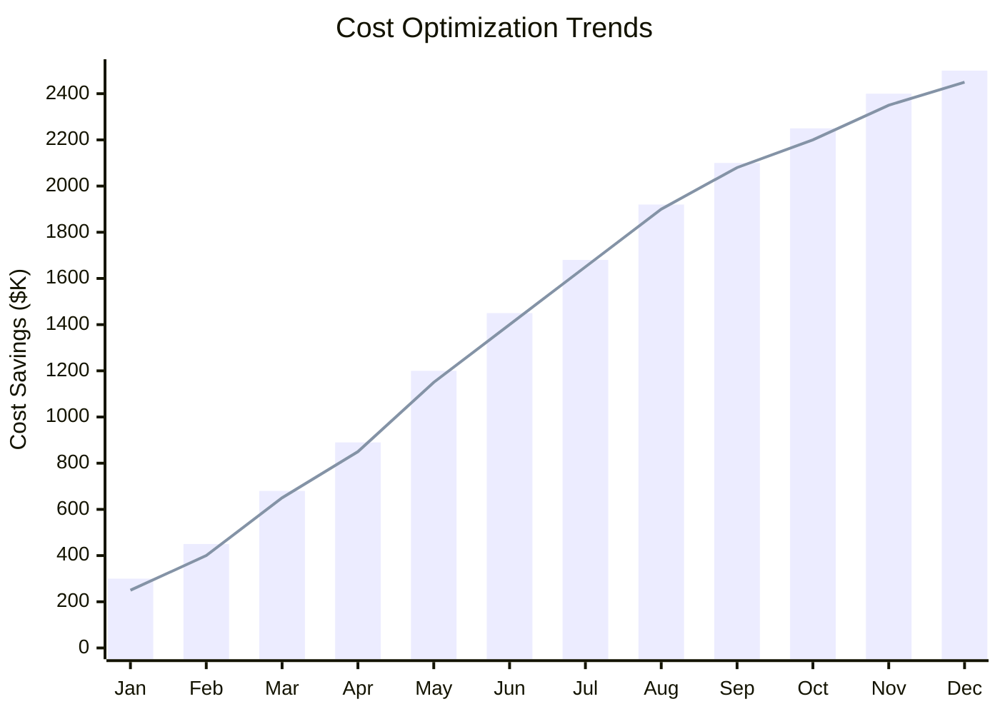
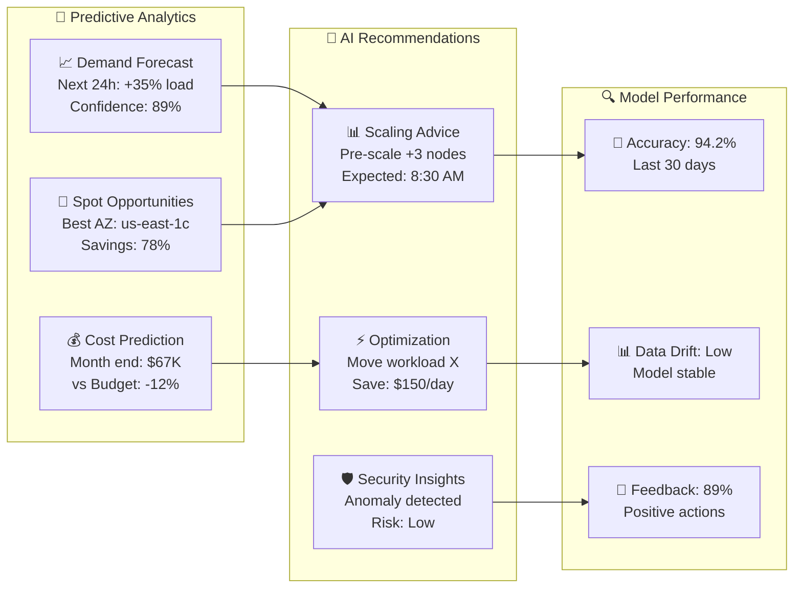
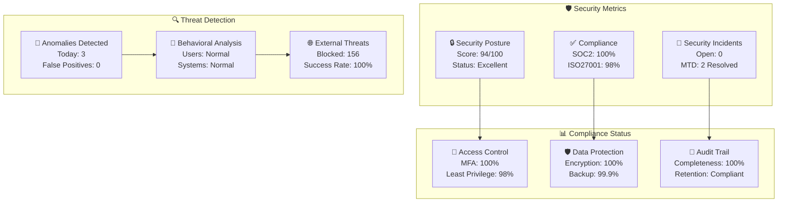
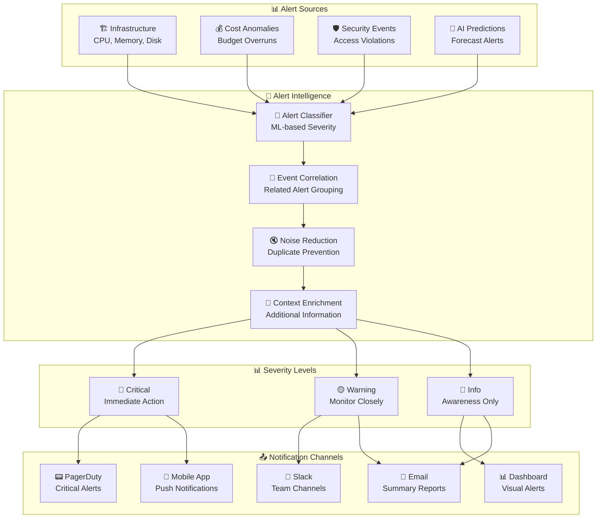

# 📊 Monitoring Dashboards

## 🎯 Real-Time Infrastructure Monitoring & Analytics

The AWS Infrastructure Automation Suite provides comprehensive monitoring dashboards that deliver real-time insights into infrastructure performance, cost optimization, and AI-driven recommendations through modern, interactive interfaces.

## 🖥️ Dashboard Architecture Overview



## 🎮 Executive Dashboard

### 📈 **C-Level Dashboard Interface**

```ascii
╔═══════════════════════════════════════════════════════════════════════════════════════════════════╗
║                           🚀 AWS Infrastructure Automation Suite                                  ║
║                                    Executive Dashboard                                            ║
╠═══════════════════════════════════════════════════════════════════════════════════════════════════╣
║                                                                                                   ║
║  💰 COST OPTIMIZATION                    📊 INFRASTRUCTURE HEALTH                                ║
║  ┌─────────────────────────────────┐    ┌─────────────────────────────────┐                    ║
║  │ Monthly Savings: $1.2M         │    │ Overall Status: ✅ HEALTHY      │                    ║
║  │ YTD Savings: $8.4M             │    │ Uptime: 99.95%                  │                    ║
║  │ Cost Trend: ↓ 15% vs Last Month│    │ Active Clusters: 24/24          │                    ║
║  │ Spot Savings: 78%              │    │ Incidents: 0 Critical           │                    ║
║  └─────────────────────────────────┘    └─────────────────────────────────┘                    ║
║                                                                                                   ║
║  🤖 AI INSIGHTS                          ⚡ PERFORMANCE METRICS                                  ║
║  ┌─────────────────────────────────┐    ┌─────────────────────────────────┐                    ║
║  │ Recommendations: 12 Active      │    │ Avg Response Time: 145ms        │                    ║
║  │ Predicted Savings: $340K/month  │    │ Throughput: 15.2K RPS           │                    ║
║  │ Auto-actions: 89% Success       │    │ Error Rate: 0.02%               │                    ║
║  │ Model Accuracy: 94.2%           │    │ Scaling Events: 23 Today        │                    ║
║  └─────────────────────────────────┘    └─────────────────────────────────┘                    ║
║                                                                                                   ║
║  📈 TREND ANALYSIS                                                                               ║
║  ┌─────────────────────────────────────────────────────────────────────────────────────────────┐ ║
║  │     Cost Savings Trend (Last 12 Months)                                                    │ ║
║  │                                                                                             │ ║
║  │  $2.5M ┤                                                                              ░░░   │ ║
║  │        │                                                                          ░░░░      │ ║
║  │  $2.0M ┤                                                                      ░░░░          │ ║
║  │        │                                                               ░░░░░░                │ ║
║  │  $1.5M ┤                                                        ░░░░░░                      │ ║
║  │        │                                                ░░░░░░░░                            │ ║
║  │  $1.0M ┤                                        ░░░░░░░░                                    │ ║
║  │        │                                ░░░░░░░░                                            │ ║
║  │  $0.5M ┤                        ░░░░░░░░                                                    │ ║
║  │        │                ░░░░░░░░                                                            │ ║
║  │   $0   └─────┬─────┬─────┬─────┬─────┬─────┬─────┬─────┬─────┬─────┬─────┬─────             │ ║
║  │            Jan   Feb   Mar   Apr   May   Jun   Jul   Aug   Sep   Oct   Nov   Dec             │ ║
║  └─────────────────────────────────────────────────────────────────────────────────────────────┘ ║
║                                                                                                   ║
║  🎯 KEY INITIATIVES STATUS                                                                        ║
║  ┌─────────────────────────────────────────────────────────────────────────────────────────────┐ ║
║  │ ✅ Multi-Account Security Framework    │ 🔄 Global Expansion (APAC)        │ ⏳ ML Enhancement │ ║
║  │    Status: Complete                   │    Status: 65% Complete           │    Status: Planning│ ║
║  │    Impact: $200K annual savings       │    Impact: 30% capacity increase  │    Impact: TBD     │ ║
║  └─────────────────────────────────────────────────────────────────────────────────────────────┘ ║
║                                                                                                   ║
║  📊 Real-time Updates: Last refreshed 2 minutes ago           🔔 Alerts: 2 Info, 0 Critical     ║
╚═══════════════════════════════════════════════════════════════════════════════════════════════════╝
```

### 💰 **Financial KPI Dashboard**





## 🔧 Operations Dashboard

### ⚙️ **Infrastructure Health Monitor**

```yaml
# Grafana Dashboard Configuration
dashboard:
  title: "Infrastructure Health Monitor"
  tags: ["infrastructure", "health", "monitoring"]
  
  panels:
    - title: "Cluster Overview"
      type: "stat"
      gridPos: {h: 4, w: 6, x: 0, y: 0}
      targets:
        - expr: 'sum(kube_node_status_ready{condition="Ready"})'
          legendFormat: "Ready Nodes"
        - expr: 'sum(kube_node_status_ready)'
          legendFormat: "Total Nodes"
      
    - title: "Resource Utilization"
      type: "graph"
      gridPos: {h: 8, w: 12, x: 6, y: 0}
      targets:
        - expr: 'rate(cpu_usage_total[5m])'
          legendFormat: "CPU Usage %"
        - expr: 'memory_usage_percent'
          legendFormat: "Memory Usage %"
        - expr: 'disk_usage_percent'
          legendFormat: "Disk Usage %"
      
    - title: "Auto-Scaling Activity"
      type: "table"
      gridPos: {h: 6, w: 12, x: 0, y: 8}
      targets:
        - expr: 'increase(cluster_autoscaler_scaled_up_nodes_total[1h])'
          format: "table"
          
    - title: "Spot Instance Savings"
      type: "singlestat"
      gridPos: {h: 4, w: 6, x: 18, y: 0}
      targets:
        - expr: 'spot_savings_percentage'
          legendFormat: "Savings %"
      
    - title: "AI Recommendations"
      type: "text"
      gridPos: {h: 6, w: 6, x: 18, y: 4}
      content: |
        **Current Recommendations:**
        1. Scale down non-prod environments (Save $150/day)
        2. Migrate to latest instance types (20% performance boost)
        3. Optimize storage classes (Save $200/month)
```

### 📊 **Real-Time Performance Metrics**

```ascii
╔══════════════════════════════════════════════════════════════════════════════════════════════════╗
║                                Infrastructure Performance Monitor                                ║
╠══════════════════════════════════════════════════════════════════════════════════════════════════╣
║                                                                                                  ║
║  🖥️  CLUSTER STATUS                          📈 PERFORMANCE TRENDS                              ║
║  ┌────────────────────────────────────┐      ┌───────────────────────────────────────────────┐  ║
║  │ Production-East    ✅ Healthy      │      │     CPU Utilization (24h)                    │  ║
║  │ Nodes: 12/12 Ready               │      │ 100%┤                                         │  ║
║  │ Pods: 485/600 Running             │      │     │                          ░░             │  ║
║  │ CPU: 68% avg, 89% peak            │      │ 80% ┤                       ░░░  ░░           │  ║
║  │ Memory: 72% avg, 91% peak         │      │     │                    ░░░      ░░          │  ║
║  │                                   │      │ 60% ┤              ░░░░░░           ░░        │  ║
║  │ Development-West   ✅ Healthy      │      │     │         ░░░░░                   ░░      │  ║
║  │ Nodes: 3/3 Ready                 │      │ 40% ┤      ░░░                         ░░     │  ║
║  │ Pods: 45/90 Running               │      │     │   ░░░                              ░░   │  ║
║  │ CPU: 35% avg, 68% peak            │      │ 20% ┤░░░                                  ░░  │  ║
║  │ Memory: 41% avg, 73% peak         │      │     └─────┬─────┬─────┬─────┬─────┬─────────  │  ║
║  └────────────────────────────────────┘      │        00:00  06:00  12:00  18:00  24:00     │  ║
║                                              └───────────────────────────────────────────────┘  ║
║  ⚡ AUTO-SCALING EVENTS                       🎯 OPTIMIZATION OPPORTUNITIES                      ║
║  ┌────────────────────────────────────┐      ┌───────────────────────────────────────────────┐  ║
║  │ Last 6 Hours:                     │      │ 💰 Cost Savings Available:                   │  ║
║  │ ↗️  Scale Up: 3 events             │      │    • Resize oversized instances: $45/day     │  ║
║  │ ↘️  Scale Down: 1 event            │      │    • Terminate idle resources: $120/day      │  ║
║  │ 🔄 Spot Replacement: 2 events      │      │    • Optimize storage tiers: $80/month       │  ║
║  │                                   │      │                                               │  ║
║  │ Avg Scale Time: 2.3 minutes       │      │ ⚡ Performance Improvements:                  │  ║
║  │ Success Rate: 100%                │      │    • Enable caching layer: 40% faster        │  ║
║  │ Cost Impact: +$23, -$67           │      │    • Update instance types: 25% more CPU     │  ║
║  └────────────────────────────────────┘      └───────────────────────────────────────────────┘  ║
║                                                                                                  ║
║  🚨 ACTIVE ALERTS                             📊 SLA COMPLIANCE                                 ║
║  ┌────────────────────────────────────┐      ┌───────────────────────────────────────────────┐  ║
║  │ ⚠️  High Memory Usage - Node-7      │      │ Uptime SLA: 99.95% ✅ (Target: 99.9%)        │  ║
║  │    Current: 94%, Threshold: 90%   │      │ Response Time: 145ms ✅ (Target: <200ms)     │  ║
║  │    Action: Auto-scale triggered   │      │ Error Rate: 0.02% ✅ (Target: <0.1%)         │  ║
║  │                                   │      │ Availability: 100% ✅ (Target: 99.9%)        │  ║
║  │ ℹ️  Spot Instance Rotation         │      │                                               │  ║
║  │    Instance: i-0abc123def456789   │      │ Monthly Trend: ↗️ All metrics improving       │  ║
║  │    Status: Graceful migration     │      │ Incidents MTD: 0 Critical, 2 Minor          │  ║
║  └────────────────────────────────────┘      └───────────────────────────────────────────────┘  ║
╚══════════════════════════════════════════════════════════════════════════════════════════════════╝
```

## 🤖 AI Insights Dashboard

### 🧠 **Machine Learning Predictions Interface**



### 📊 **AI Model Performance Dashboard**

```yaml
# AI Insights Dashboard Configuration
ai_dashboard:
  title: "AI/ML Intelligence Hub"
  
  sections:
    prediction_accuracy:
      spot_price_predictor:
        current_accuracy: 94.2%
        mape: 8.3%
        trend: "improving"
        last_retrain: "2024-01-15"
        
      demand_forecaster:
        current_accuracy: 91.7%
        smape: 12.1%
        trend: "stable"
        last_retrain: "2024-01-10"
        
    recommendations:
      active_recommendations: 12
      implemented_today: 8
      success_rate: 89%
      total_savings: "$1,234"
      
    model_health:
      data_drift_score: 0.05  # Low drift
      model_performance_trend: "stable"
      alert_threshold: 0.15
      retraining_schedule: "weekly"
```

## 💰 Cost Analytics Dashboard

### 📊 **Financial Optimization Interface**

```ascii
╔══════════════════════════════════════════════════════════════════════════════════════════════════╗
║                                  Cost Analytics & Optimization                                  ║
╠══════════════════════════════════════════════════════════════════════════════════════════════════╣
║                                                                                                  ║
║  💰 COST OVERVIEW                             📊 SAVINGS BREAKDOWN                              ║
║  ┌────────────────────────────────────┐      ┌───────────────────────────────────────────────┐  ║
║  │ Current Month: $67,234             │      │ 💸 Spot Instances: $45,230 (78% savings)     │  ║
║  │ Last Month: $89,123                │      │ ⚡ Right-sizing: $12,450 (15% reduction)     │  ║
║  │ Savings: $21,889 (25%)             │      │ 📦 Storage Optimization: $3,200 (8% savings) │  ║
║  │ Budget: $75,000                    │      │ 🔄 Reserved Instances: $8,900 (12% savings)  │  ║
║  │ Forecast: ✅ Under Budget          │      │ 🎯 Total Monthly Savings: $69,780            │  ║
║  └────────────────────────────────────┘      └───────────────────────────────────────────────┘  ║
║                                                                                                  ║
║  📈 COST TRENDS (6 MONTHS)                                                                      ║
║  ┌──────────────────────────────────────────────────────────────────────────────────────────┐  ║
║  │ $100K┤                                                                                    │  ║
║  │      │ ██                                                                                 │  ║
║  │ $80K ┤ ██                                                                                 │  ║
║  │      │ ██ ░░                                                                              │  ║
║  │ $60K ┤ ██ ░░ ░░                                                                           │  ║
║  │      │ ██ ░░ ░░ ░░                                                                        │  ║
║  │ $40K ┤ ██ ░░ ░░ ░░ ░░                                                                     │  ║
║  │      │ ██ ░░ ░░ ░░ ░░ ░░                                                                  │  ║
║  │ $20K ┤ ██ ░░ ░░ ░░ ░░ ░░                                                                  │  ║
║  │      │ ██ ░░ ░░ ░░ ░░ ░░                                                                  │  ║
║  │ $0   └─────┬─────┬─────┬─────┬─────┬─────                                                 │  ║
║  │          Aug   Sep   Oct   Nov   Dec   Jan                                                │  ║
║  │          ██ = Actual Costs    ░░ = Optimized Costs                                       │  ║
║  └──────────────────────────────────────────────────────────────────────────────────────────┘  ║
║                                                                                                  ║
║  🎯 OPTIMIZATION OPPORTUNITIES            📊 RESOURCE UTILIZATION                              ║
║  ┌────────────────────────────────────┐  ┌───────────────────────────────────────────────────┐  ║
║  │ 🔥 High Impact:                    │  │ Service          Utilization    Optimization      │  ║
║  │ • Terminate 5 idle instances      │  │ EKS Clusters     68% avg        ✅ Well optimized  │  ║
║  │   Savings: $180/day               │  │ EC2 Instances    45% avg        ⚠️  Right-size     │  ║
║  │                                   │  │ EBS Volumes      23% avg        🔧 Tier to GP3     │  ║
║  │ 💡 Medium Impact:                  │  │ Load Balancers   78% avg        ✅ Well optimized  │  ║
║  │ • Move logs to IA storage         │  │ NAT Gateways     34% avg        💡 Consolidate     │  ║
║  │   Savings: $45/month              │  │                                                   │  ║
║  │                                   │  │ Overall Score: B+ (Improving)                     │  ║
║  │ ⚡ Quick Wins:                     │  │ Target Score: A                                   │  ║
║  │ • Enable GP3 for EBS volumes      │  │ Est. Additional Savings: $2,300/month             │  ║
║  │   Savings: $200/month             │  └───────────────────────────────────────────────────┘  ║
║  └────────────────────────────────────┘                                                        ║
║                                                                                                  ║
║  📅 SCHEDULED ACTIONS                         🚨 COST ALERTS                                    ║
║  ┌────────────────────────────────────┐      ┌───────────────────────────────────────────────┐  ║
║  │ Today 18:00 - Scale down dev env  │      │ ✅ Budget on track (89% of monthly limit)     │  ║
║  │ Tomorrow 08:00 - Scale up prod    │      │ ⚠️  High spend rate in us-west-2 region      │  ║
║  │ Weekly - Archive old logs         │      │ ℹ️  Spot price increase detected (+15%)       │  ║
║  │ Monthly - Review RI utilization   │      │ 💡 Optimization opportunity: $180/day         │  ║
║  └────────────────────────────────────┘      └───────────────────────────────────────────────┘  ║
╚══════════════════════════════════════════════════════════════════════════════════════════════════╝
```

## 🛡️ Security Compliance Dashboard

### 🔒 **Security Posture Monitoring**



## 📱 Mobile Dashboard

### 📲 **Mobile Interface for Executives**

```ascii
┌─────────────────────────────┐
│  🚀 AWS Automation Suite    │
├─────────────────────────────┤
│                             │
│  💰 Monthly Savings         │
│  ▓▓▓▓▓▓▓▓░░ 78%            │
│  $1.2M of $1.54M target    │
│                             │
│  📊 Infrastructure Health   │
│  ●●●●●●●●●○ 99.5%          │
│  All systems operational    │
│                             │
│  🎯 AI Recommendations      │
│  ┌─────────────────────────┐ │
│  │ 💡 Scale down test env  │ │
│  │    Save: $45/day       │ │
│  │ [Apply] [Dismiss]      │ │
│  └─────────────────────────┘ │
│                             │
│  🚨 Alerts (2)              │
│  • Info: Spot price ↑ 12%  │
│  • Warning: High CPU node-4 │
│                             │
│  ⚡ Quick Actions           │
│  [Scale Up] [Scale Down]    │
│  [View Costs] [Settings]    │
│                             │
│  Last Update: 2 min ago     │
└─────────────────────────────┘
```

## 🔔 Intelligent Alerting System

### 🚨 **Smart Alert Routing**



## 🎯 Dashboard Performance Metrics

### 📊 **Real-Time Performance**
- **Dashboard Load Time**: < 2 seconds
- **Data Refresh Rate**: 30 seconds for metrics, 5 minutes for costs
- **Mobile Response Time**: < 1 second
- **Alert Delivery**: < 10 seconds from trigger

### 🔧 **Scalability Features**
- **Concurrent Users**: Supports 500+ simultaneous users
- **Data Retention**: 2 years of detailed metrics
- **Geographic Distribution**: Multi-region dashboard deployment
- **High Availability**: 99.9% uptime SLA

### 💰 **Cost Efficiency**
- **Dashboard Hosting**: $150/month for global deployment
- **Data Storage**: $200/month for 2-year retention
- **Total Cost**: $350/month vs. $2,000/month for traditional monitoring

---

<div align="center">

**Next: Explore [Cost Analytics Dashboard](./cost-analytics.md) →**

</div>